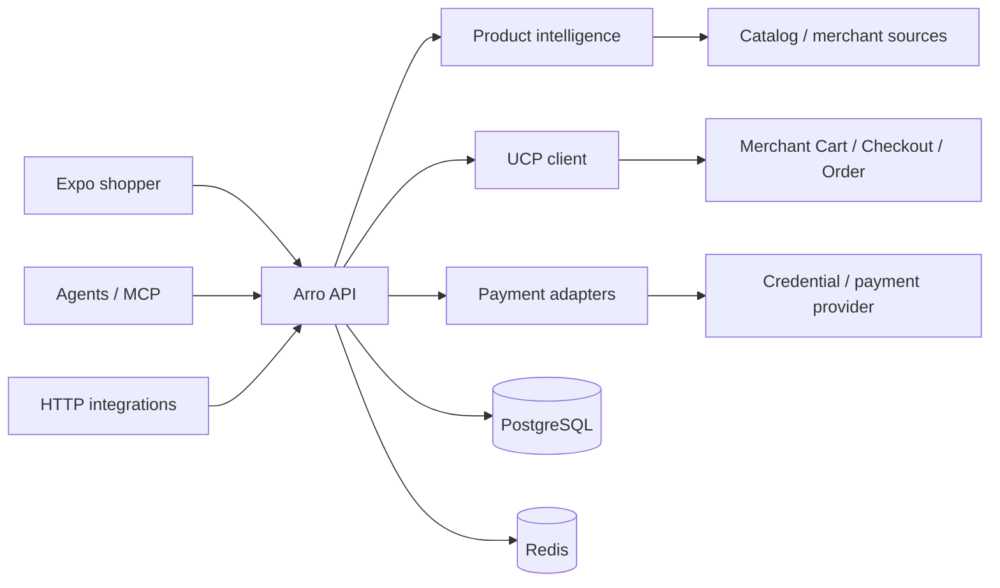

# Arro

Arro is an **agentic commerce intelligence, trust, continuity and execution layer** for real shopping across merchants and surfaces.

It turns intent into source-backed product decisions, preserves what is known/unknown, prepares or executes only the commerce actions that current merchant capabilities and user authority allow, and stays with the purchase until a merchant Order or an exact blocker is known.

```text
search → inspect → compare → decide
                     ↓
             prepare purchase
                     ↓
        merchant checkout / payment
                     ↓
               merchant Order
                     ↓
          reconcile / cancel / recover
```

Arro serves both:

- a first-party Expo shopper;
- external agents/integrations through HTTP and MCP.

Both use the same source, trust, purchase and merchant-Order semantics.

## Product invariants

- **Merchant/source authority survives normalization.** Arro does not become product truth merely because it stores or renders a merchant response.
- **Merchant Order is completion truth.** Payment UI/provider events do not equal an Order.
- **No-buy is a successful outcome.** Weak/stale/unsafe evidence can correctly produce “do not buy” or a safer alternative.
- **Commercial isolation.** Affiliate/commission/sponsorship economics do not secretly change ranking, product truth, warnings or checkout totals.
- **Portable buying state.** The durable product is resumable source-backed commerce state, not one card/chat response.
- **Action authority is explicit.** Hosts can downscope Arro; they cannot grant merchant/payment authority Arro did not negotiate.
- **Checkout presentation follows executable capability.** Direct UCP checkout uses the installed native payment executor. Merchant continuations carry an explicit presentation: standard UCP embedding on web/iOS/Android, an isolated Shopify Checkout Kit adapter on native, or browser continuation. URL paths never select an SDK, and failed native presentation offers recovery instead of silently opening a browser.
- **Arro is not Merchant of Record, a payment wallet, a scraper or a paid-ranking marketplace.**

See [docs/PRODUCT.md](docs/PRODUCT.md) for the complete product source of truth.

## Current implementation status

### Implemented

- real-source catalog search, product detail, comparison and sanity checking;
- source/freshness/caveat/no-buy/commercial-disclosure/authority trust signals;
- Shopify Global/Storefront Catalog MCP adapters plus explicit merchant source adapters, including preservation of multi-merchant Global Catalog offers and opaque single-source cursor continuation;
- first-party React Native/Expo Router shopper with route-backed Discover, Category, Results, Detail, Cart, Saved, Compare, Account and Checkout surfaces; search/product/checkout state is route-addressable, while compare selection, cart and saved list are intentionally device- or session-local until a compact reconstructable URL contract and account continuity exist;
- HTTP API and canonical MCP server;
- UCP profile discovery, capability/handler negotiation and authority binding;
- UCP Cart/Checkout/Order orchestration;
- first-party owner-scoped checkout over the compact purchase runtime, with merchant-hosted continuation only when the negotiated merchant path requires it;
- merchant-owned live Stripe PaymentSheet execution on iOS and Android, with
  Visa/Mastercard card entry on both platforms and Stripe Google Pay on Android;
- Android native `com.google.pay` action execution with device/build capability negotiation, provider readiness checks, cancellation-safe result submission and an explicit external fallback;
- payment actions/result exchange and consume-once credential vault;
- idempotency and unknown-outcome recovery;
- signed full-Order webhook continuity;
- data-rights access/export/correction/delete;
- source governance/conformance/audit;
- typed commerce-memory internal foundation;
- purchase mandates/autonomous job substrate with strict runtime gating.

### Runtime-conditional

Implemented code exists, but activation depends on the exact provider, merchant, configuration, keys, and evidence:

- merchant-owned Stripe PaymentSheet through Processor Tokenizer;
- other Processor Tokenizer handlers;
- Android native Google Pay;
- Arro-hosted Google Pay Web fallback;
- trusted-host payment;
- AP2;
- Embedded Checkout;
- autonomous purchasing;
- merchant-advertised x402/MPP portable-protocol routes.

### Designed/deferred product extensions

The broader product direction deliberately retains:

- saved decision workspace beyond the current device-local saved list: collections, notes, cross-device sync and migration of guest state into an account;
- price and stock watches;
- secondhand/resale/refurbished comparison;
- discounts/loyalty/membership intelligence;
- richer order/refund/return/support continuity;
- merchant identity linking;
- internationalization/localization;
- visual search/product scan;
- collaborative shopping;
- source-backed public product/comparison pages;
- richer owned Arro commerce-AI surfaces.

These are documented as future capability intent, **not** current launch claims.

## Architecture



- PostgreSQL is the durable commerce state.
- Redis holds bounded ephemeral state such as rate limits and consume-once encrypted payment credentials.
- Provider-specific payloads terminate at adapter boundaries.
- The first-party app never receives backend/payment secrets.

See [docs/ARCHITECTURE.md](docs/ARCHITECTURE.md).

## Protocol posture

The transaction runtime is pinned to released UCP `2026-08-25`. It negotiates
core capabilities separately from payment-handler versions: for example,
Google Pay remains `com.google.pay` version `2026-01-23`.

Important distinctions:

- the first-party mobile path is native-first; UCP is the merchant checkout contract, not a requirement to open a browser;
- Actions are typed, single-use protocol work and never imply payment or Order success;
- AP2 is optional by negotiation and strict once active;
- Embedded Checkout is session/delegation dependent;
- x402/MPP are explicit experimental portable adapters, not official UCP payment handlers;
- Stripe runs through an exact merchant-owned Processor Tokenizer contract. The
  merchant creates the live PaymentIntent and owns its Stripe account; Arro has
  no platform Stripe secret and accepts only the bound opaque PaymentIntent ID
  back from the app.

See [docs/NATIVE_CHECKOUT.md](docs/NATIVE_CHECKOUT.md) for the product/runtime
contract and [docs/PROTOCOLS.md](docs/PROTOCOLS.md) for protocol details.

## Repository

```text
apps/
  api/                    Elysia API, MCP and commerce runtime
  app/                    Expo / React Native shopper
packages/
  contracts/              shared runtime schemas/types
  product-intelligence/   search/comparison/product reasoning
  ucp-client/             UCP discovery/negotiation/transport
services/
  connectors/             merchant/catalog adapters
database/migrations/      PostgreSQL schema history
agent-skills/              host skill/examples
docs/                     product/protocol/architecture/operations docs
```

## Requirements

- Node.js: package engine `>=26.8.2 <27`; repository `.nvmrc` pins Node 26.8.2.
- Vercel frontend function: Node 24.x through the isolated `apps/app` engine and
  checked-in Expo server adapter; the Render API stays on Node 26.8.2.
- PostgreSQL.
- Redis for payment credential vault/rate-limit runtime when enabled.

## Install

All workspaces, including the Expo shopper:

```bash
nvm use
npm ci
```

The repository has one lockfile and one install graph. Do not run a second
install inside `apps/app`.

## Local development

Create local configuration once, then start Postgres/Redis:

```bash
cp .env.example .env
npm run infra:up
```

The API runtime commands use Node 26's optional root `.env` loading. Shell environment variables still override `.env` values.

Apply migrations:

```bash
npm run db:migrate
```

API:

```bash
npm run dev:api
```

App:

```bash
npm run dev:app
```

## Local API through Cloudflare Tunnel

Run Arro locally with Docker, then expose the API through a stable named Cloudflare Tunnel such as `api.atishghimire.com.np`. Tunnel credentials, DNS routing and process lifecycle are machine/deployment infrastructure and intentionally stay outside repository npm scripts.

For ordinary local development:

```bash
npm run infra:up
npm run db:migrate
docker compose up -d --build api
```

For a public production-mode tunnel, put the six host secret-file paths required
by `compose.production.yml` in the ignored root `.env`, then run:

```bash
docker compose -f compose.yml -f compose.production.yml up -d --build
cloudflared tunnel run arro-local
```

Keep `PUBLIC_BASE_URL` on the stable public HTTPS origin so web, native clients and UCP integrations share one identity.
Compose binds API/PostgreSQL/Redis ports to loopback. Run `cloudflared` under its
restart-enabled system service for persistent ingress; the foreground command
above is suitable only for an attended smoke test.
The base Compose file is a development convenience. Its production override
mounts database/API/session/frontend/UCP material read-only under
`/run/secrets`; Render supplies the same values through its managed environment.
Neither path puts private material in the image or source control.

## Shopper API

Canonical search:

```http
POST /v1/catalog/search
```

The current frontend also consumes product detail/comparison APIs. Source labels and merchant identity should remain visible throughout the UI.

## Agent API / MCP

Canonical MCP endpoint:

```http
POST /v1/mcp
```

Current tool lifecycle:

```text
agent_diagnostics
→ search_products
→ get_product_detail
→ compare_products / sanity_check_product
→ prepare_purchase
→ update_purchase (when needed)
→ prepare_payment (when a direct route is available)
→ provide_payment (exact signed action/result)
→ confirm_purchase
→ get_purchase
```

`cancel_purchase` is available where current merchant/runtime semantics support cancellation.

See [docs/agent-distribution-kit/README.md](docs/agent-distribution-kit/README.md).

## UCP commerce

The purchase path does not require the old proprietary DecisionReceipt/checkout-attempt transaction tables. Migration 037 removed them from the authoritative runtime.

Current authority flows through scoped purchase/UCP checkout/payment/confirmation/mandate/merchant-Order state.

DecisionReceipt/IntentRecord concepts remain **design lineage for portable decision state**, not mandatory UCP checkout gates. See [docs/PRODUCT.md](docs/PRODUCT.md#8-buying-state-memory-and-decisionreceipt-lineage).

## Payment routes

### Preferred first-party path

- merchant UCP checkout rendered by Arro, with the merchant's live Stripe
  PaymentSheet on iOS and Android for Visa/Mastercard, plus Stripe Google Pay on
  Android when the device and merchant account are eligible. PaymentSheet never
  replaces merchant UCP completion or merchant Order authority.

### Runtime-conditional routes and fallbacks

- Processor Tokenizer;
- Arro-hosted Google Pay Web fallback;
- trusted-host payment;
- AP2;
- Embedded Checkout delegation;
- merchant-hosted continuation when the native path is unavailable or the
  merchant requires escalation;
- exact merchant-advertised x402/MPP portable payment contracts.

A direct payment route is not “enabled” until its merchant/provider/configuration/evidence tuple is valid.

See [docs/PROTOCOLS.md](docs/PROTOCOLS.md#10-payment-handlers-contract-not-brand-checkbox).

## Frontend

Expo 57 / Expo Router 57, React 19, React Native 0.86 + React Native Web, Uniwind with Tailwind CSS 4, Zustand.

The shopper is a price-comparison surface: a derived facet bar that only shows dimensions the returned facts can actually change, product groups that keep merchant offers under one authoritative product identity, and a freshness stamp on every result set with the selling shop named on every offer.

Phone and pointer get different shells rather than one stretched composition: a bottom tab bar, a full-screen search surface and facet sheets on a phone; a header utility row, a category mega-menu and a filter rail that stays open on a pointer. A device-local cart spans shops while each checkout stays scoped to one, and a saved list keeps the search that led to each item and revalidates price and availability when it is reopened.

The web build is server-rendered. `web.output` is `server`, indexable routes carry an Expo Router `loader` and `generateMetadata`, and product and search pages ship real HTML with Schema.org `Product`, `AggregateOffer`, `ItemList` and `BreadcrumbList` before any JavaScript runs. `/robots.txt`, `/sitemap.xml` and `/llms.txt` are API routes.

Commands:

```bash
npm run check:app
npm run dev:app
npm run build:app
npm run serve:app
```

`build:app` needs the public origins so canonical links and server-side data fetches resolve:

```bash
EXPO_PUBLIC_ARRO_API_URL=https://api.example.com EXPO_PUBLIC_ARRO_SITE_URL=https://arro.example npm run build:app
```

Web development can use the localhost API fallback. Physical/native development must set `EXPO_PUBLIC_ARRO_API_URL` to a device-reachable API URL; production must use the public HTTPS API origin.

See [docs/FRONTEND.md](docs/FRONTEND.md).

## Canonical engineering commands

Daily development and CI should use a small command surface:

```bash
npm run clean
npm run verify
npm run db:migrate
npm run dev:api
npm run dev:app
npm run build:app
```

`npm run verify` runs the workspace build and typecheck, the full automated test suite, and Expo dependency/type validation. `verify:launch` adds one isolated software path, a production web export, and live readiness/discovery/payment smoke checks; protocol cases already covered by the test suite are not replayed as standalone scripts.

## Production configuration

Use `.env.example` as the runtime field reference, but supply production values through your deployment secret/config system.

At minimum the production environment needs:

- public base URL; the UCP profile URL defaults to `PUBLIC_BASE_URL/.well-known/ucp`;
- a separate public HTTPS `EXPO_PUBLIC_ARRO_SITE_URL` origin for frontend canonical URLs and crawl surfaces;
- production PostgreSQL and Redis;
- API/session secret material;
- one identical server-only `ARRO_FRONTEND_SERVER_TOKEN` on the API and Vercel
  SSR runtime;
- one dedicated EC P-256 UCP platform private JWK from the deployment secret store;
- the built-in Shopify Global Catalog baseline, or an explicit `CATALOG_ADAPTERS_JSON` override for a different source registry;
- exact payment route config only for routes you will advertise;
- required merchant-specific `UCP_PAYMENT_HANDLER_SPECS_JSON` and
  `UCP_TOKENIZER_AUTH_JSON` secrets for the live Stripe Processor Tokenizer path;
- exact allowed app origins;
- separate verification Postgres/Redis.

See [docs/OPERATIONS.md](docs/OPERATIONS.md).

### Repository readiness versus launch activation

The repository contains the Vercel SSR adapter, production API startup path,
native Stripe PaymentSheet executor, Android `com.google.pay` executor, and
application/API contracts. The checked-in Render Blueprint is deliberately a
free temporary-staging topology: it runs real catalog and merchant UCP
cart/checkout traffic but leaves every direct payment executor disabled. It does
not install a test gateway or ask for fictional provider secrets. Activating the
native Stripe path requires the real merchant-specific
`UCP_PAYMENT_HANDLER_SPECS_JSON`, `UCP_TOKENIZER_AUTH_JSON`, payment secrets and
paid durable Render resources. Source support is not evidence that cloud
accounts, DNS, a launch merchant Stripe account, or live endpoint credentials
have been activated.

Before public traffic, complete one controlled merchant-authoritative live flow
from PaymentSheet through the merchant `/tokenize` contract and UCP completion
to a returned Order. Apple Pay is not a launch claim: an Apple Merchant ID and
the associated Stripe/Apple capability have not been activated.

## Final launch verification

Inspect the full ordered verification plan:

```bash
npm run verify:launch -- --plan
```

Run it against the actual production release environment/public API:

```bash
npm run verify:launch
```

Launch verification includes backend/app validation, UCP protocol behavior, isolated software verification, production configuration/capability checks, payment activation, and public UCP/MCP/search checks.

The deployment secret manager owns UCP key generation, versioning and rotation.
Prepublish the next public key, wait through the advertised profile cache TTL,
then promote the new private signer while retaining the previous public key for
in-flight verification. Private JWK material must never enter source control,
logs, profiles or `EXPO_PUBLIC_*` configuration.

## Performance posture

The hot path stays intentionally boring:

- bounded source fan-out;
- connection reuse;
- bounded DNS/source-state caching;
- query/index shapes matched to actual access patterns;
- `FOR UPDATE SKIP LOCKED` for worker claims;
- bounded mandate job history;
- no N+1 detail calls for grid images;
- PostgreSQL as durable state;
- Redis as the expiring catalog projection, coordination layer and short-lived
  credential vault—not the commerce ledger;
- reconciliation before retry after unknown outcomes.

The full performance source of truth is restored in [docs/PERFORMANCE.md](docs/PERFORMANCE.md).

## Documentation map

| Document                                                                                   | Responsibility                                                      |
| ------------------------------------------------------------------------------------------ | ------------------------------------------------------------------- |
| [docs/PRODUCT.md](docs/PRODUCT.md)                                                         | product intent, principles, feature/capability map, non-goals       |
| [docs/PROTOCOLS.md](docs/PROTOCOLS.md)                                                     | UCP/source/payment/agent interoperability and stable-vs-draft truth |
| [docs/ARCHITECTURE.md](docs/ARCHITECTURE.md)                                               | current implementation boundaries, state and data domains           |
| [docs/PERFORMANCE.md](docs/PERFORMANCE.md)                                                 | performance/runtime/SQL/scaling quality engineering                 |
| [docs/FRONTEND.md](docs/FRONTEND.md)                                                       | first-party UX and future surface contract                          |
| [docs/OPERATIONS.md](docs/OPERATIONS.md)                                                   | deployment, release, retention, data rights, incident/support       |
| [docs/agent-distribution-kit/README.md](docs/agent-distribution-kit/README.md)             | external agent integration                                          |
| [docs/hermes-agent-shopify-quickstart.md](docs/hermes-agent-shopify-quickstart.md)                 | Hermes first-success path                                           |
# zylo-copy
