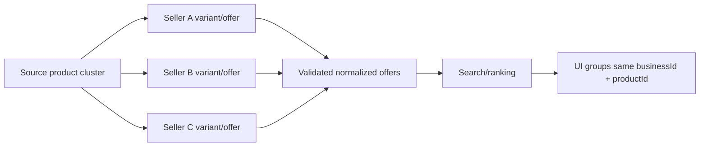
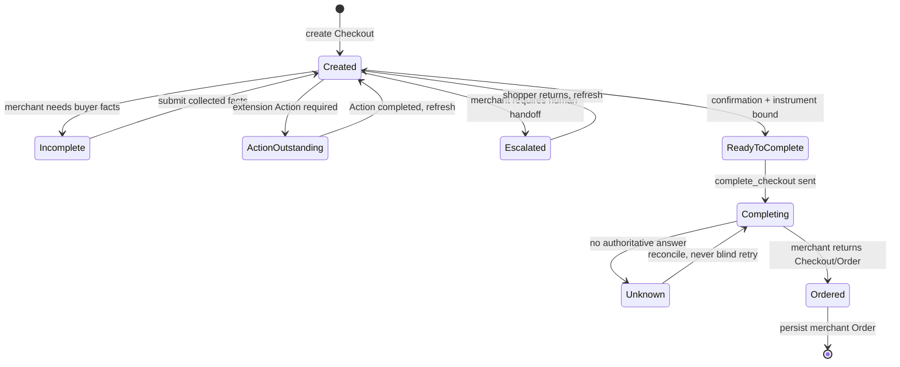

# Arro Architecture

## 1. Design rule

Arro should make a complex commerce system feel small.

```text
merchant/source truth
        ↓
normalized contracts
        ↓
decision + execution
        ↓
authoritative reconciliation
```

It is not a scraper-shaped database, a payment processor, or a second merchant backend. It is the orchestration layer that keeps source identity, user authority, checkout state and recovery coherent across heterogeneous commerce systems.

## 2. Runtime boundaries

```text
┌─────────────── Clients ───────────────┐
│ Expo app │ HTTP integrations │ Agents │
└────────────────┬──────────────────────┘
                 ▼
┌──────────────── Arro API ─────────────────────────────┐
│ catalog │ compare │ purchase │ payment │ Order │ MCP  │
└───────┬───────────────────────────────┬───────────────┘
        ▼                               ▼
┌───────────────┐              ┌───────────────────────┐
│ Connectors    │              │ UCP client            │
│ source reads  │              │ merchant transactions │
└───────┬───────┘              └───────────┬───────────┘
        ▼                                  ▼
  merchant catalogs                merchant checkout/order
        └──────────────┬───────────────────┘
                       ▼
              PostgreSQL + Redis
```

Package ownership:

- `@arro/contracts`: wire/runtime schemas. No network and no persistence.
- `@arro/product-intelligence`: deterministic search/comparison logic.
- `@arro/connectors`: bounded external catalog reads and source normalization.
- `@arro/ucp-client`: UCP discovery, capability negotiation and transport.
- `@arro/api`: orchestration, persistence, HTTP/MCP and payment execution.
- `@arro/app`: user interface only.

A package should not reach across these boundaries merely to reuse an internal helper.

## 3. Catalog hot path

```text
POST /v1/catalog/search
        │
        ├─ parse + normalize intent
        ├─ load target-business/source state
        ├─ choose bounded eligible sources
        │     └─ execute with bounded concurrency
        ├─ validate each source response
        ├─ normalize product + offer facts
        │     └─ preserve seller offers inside authoritative product clusters
        ├─ score/filter
        ├─ rank top N authoritative product groups without truncating their merchant offers
        └─ return source-labelled products/offers
```

For sources that return one canonical product with several seller offers (notably Shopify Global Catalog), the connector expands seller-bearing variants into normalized offer rows **without changing the authoritative `productId`**. The first-party UI groups `businessId + productId` in O(n) time and renders one product card with a real merchant-offer list.

Search continuation is source-scoped. A raw upstream cursor is never a public Arro cursor; the API wraps it with source identity and only emits continuation for a single dispatched cursor-capable source. Federated pagination stays disabled until the merge can retain below-cut candidates instead of silently skipping them.



No frontend or ranker title-similarity heuristic is allowed to create cross-source canonical identity.

### Performance decisions

The request does **not**:

- fetch product detail for each search card;
- perform a database query per product;
- serially wait on every source;
- copy raw provider payloads into result ranking;
- expand source fan-out beyond configured request bounds.

`CatalogProductSummary` carries `imageUrl` when available. UCP adapters derive it from merchant media; Shopify Storefront GraphQL requests `featuredImage` in the same search query. This removes a classic product-grid N+1.

Source/business state is loaded set-wise and cached briefly at the application layer. Connector concurrency is controlled by:

- `CATALOG_CONNECTOR_MAX_SOURCES_PER_REQUEST`;
- `CATALOG_CONNECTOR_MAX_CONCURRENCY_PER_REQUEST`;
- `CATALOG_CONNECTOR_COALESCING_WINDOW_MS`;
- per-origin HTTP connection limits.

Increasing these numbers is not automatically faster: merchant quotas and tail latency usually become the bottleneck before Node CPU does.

## 4. Product detail and comparison

Detail uses one source-authoritative lookup for the selected product/offer. A route may carry a preferred `variantId` so a multi-merchant source resolves the seller the shopper actually selected.

```text
summary → product lookup → normalized detail
                        ├─ media
                        ├─ options
                        ├─ variants
                        ├─ warnings
                        └─ seller/handoff
```

Comparison accepts normalized product inputs already returned by search. It does not re-scrape every merchant unless a future criterion explicitly requires fresh detail.

The Expo app keeps 2–4 selected products locally in Zustand and sends one compare request.

## 5. UCP negotiation

```text
Business profile
      +
Arro platform profile
      ↓
validate namespace/schema authority
      ↓
intersect versions independently
      ↓
activate capabilities/extensions
      ↓
intersect payment handlers
      ↓
choose REST/MCP operation transport
```

Protocol, capability, extension and payment-handler versions are independent. Never require a handler version to equal the top-level protocol version.

Unknown or authority-invalid declarations are not activated.

Arro's UCP profile is a platform identity, not a merchant storefront. Platform
service entries describe client binding schemas and omit business `endpoint`
claims. A dedicated identity boundary derives public-only JWKs for the profile
and gives the private P-256 key only to the outbound UCP request signer. The
signer serializes each JSON body once, digests those exact bytes, and adds RFC
9421/9530 headers before the connector transport sends it. Neither contracts,
logs, persistence, the first-party app, nor discovery responses receive `d`.

## 6. Checkout lifecycle



Arro owns continuity, not merchant truth.

A client-side payment event, iframe completion, redirect, provider UI result or successful HTTP call is never equivalent to an Order. Completion is accepted after the merchant returns the authoritative Checkout/Order state.

## 7. UCP Actions

An Action is extension-defined work outstanding on a UCP resource.

Runtime rules:

1. the Action type must belong to a negotiated extension;
2. the exact extension version must match the negotiated version;
3. config is validated by the installed handler;
4. browser execution origins come from Arro's trusted handler adapter configuration, not arbitrary merchant JSON;
5. Action completion triggers authoritative Checkout refresh;
6. unsupported Actions remain visible blockers with merchant continuation when possible.

Payment authentication handlers cover device-data collection and 3DS challenge semantics. Experimental payment render artifacts remain isolated from the stable advertised profile until their protocol contract is stable.

## 8. Payment separation

```text
PaymentHandlerRuntime
  discover handler
  → acquire/tokenize credential
  → construct UCP instrument
  → submit to merchant

PaymentActionRuntime
  DDC / 3DS / render artifact
  → wait
  → refresh merchant state
```

These are intentionally separate. One giant payment adapter would couple credential acquisition, browser authentication and settlement recovery into an untestable state machine.

Raw card credentials are outside Arro's intended path. Temporary provider credentials are consume-once, encrypted in Redis, and represented durably only by redacted references.

## 9. Persistence

PostgreSQL is the continuity source of truth.

Key transaction records:

```text
ucp_checkout_sessions
        │
        ├── ucp_checkout_operations
        ├── ucp_payment_results
        ├── ucp_payment_actions
        ├── ucp_orders
        └── ucp_order_webhook_events
```

Redis is used for ephemeral, bounded state such as consume-once credential envelopes and rate-limit state. It is not the durable Order ledger.

## 10. Performance and SQL

The final audit focused on query shape rather than adding speculative indexes.

| Hot path                        | Query/index posture                                           |
| ------------------------------- | ------------------------------------------------------------- |
| Checkout by local transaction   | primary/unique transaction identity                           |
| Checkout by merchant + checkout | composite merchant/checkout index                             |
| Latest payment result           | transaction + `created_at desc`                               |
| Order identity                  | merchant/order uniqueness                                     |
| Webhook dedupe                  | unique merchant/dedupe hash                                   |
| Autonomous worker claim         | partial claimable-state/time index + `FOR UPDATE SKIP LOCKED` |
| Mandate job history             | exact mandate/owner/created ordering + bounded latest 100     |

### Order persistence

Order persistence previously looked up checkout owner columns through two scalar subqueries. It now performs one indexed lookup against the unique checkout transaction and inserts from that row. The existing foreign key still requires a durable Checkout session before an Order can be stored.

### Webhook dedupe

The webhook insert uses the unique `(merchant_origin, dedupe_hash)` identity with `ON CONFLICT DO NOTHING`. Duplicate event rows are therefore suppressed at the database boundary.

Arro intentionally still re-runs the following indexed Checkout lookup and idempotent Order upsert for a duplicate delivery. That small amount of work preserves recovery if a process dies after recording the webhook but before persisting the Order.

### Autonomous history

`listForMandate` is a history/read API, not an export endpoint. It is bounded to the latest 100 jobs.

Migration `050_autonomous_job_history_index.sql` adds:

```text
(mandate_id, owner_key_id, owner_principal_hash, created_at desc)
```

which matches the filter and order exactly.

### What was deliberately not added

No blanket:

- trigram indexes;
- JSONB GIN indexes;
- per-request Redis cache;
- catalog-result database cache;
- extra worker queues;
- ORM;
- materialized views.

Those would add write cost and invalidation complexity without an observed hot query.

## 11. Idempotency and unknown outcome

State-changing commerce operations bind an idempotency identity to a normalized request fingerprint.

```text
same key + same request → replay original semantic result
same key + different request → conflict
network timeout after write → read/reconcile before retry
```

This is essential for checkout/payment safety and also improves performance by preventing duplicate merchant work.

## 12. Request lifecycle

The API has one request budget. Connector calls inherit cancellation/timeout signals. Shutdown enters drain mode and stops accepting normal work while letting health probes continue.

Public browser access uses an exact-origin CORS allowlist via `APP_ALLOWED_ORIGINS`. It is separate from server-to-server API authentication.

## 13. Scaling

For an initial 1,000-account beta, scale by observed concurrency, not registered-user count.

Start with:

- one or more stateless API processes;
- PostgreSQL sized for connection/query latency;
- Redis;
- bounded connector fan-out.

Measure:

- request p50/p95/p99;
- connector latency/error rate;
- DB pool wait time;
- checkout completion/reconciliation latency;
- webhook backlog;
- process memory and event-loop health.

Scale API replicas only after identifying saturation. Do not increase database pool sizes independently on every replica without considering the database connection ceiling.

## 14. Failure model

```text
source unavailable
  → limited/unavailable search with source message

merchant rejects checkout
  → preserve merchant structured reason

payment UI succeeds but merchant unknown
  → reconciliation required, not "paid"

duplicate webhook
  → acknowledge without duplicate effect

process dies
  → durable checkout/order state survives in PostgreSQL

Redis temporary credential expires
  → reacquire; never manufacture credential
```

That is the intended complexity boundary: simple interfaces, explicit state, authoritative recovery.
