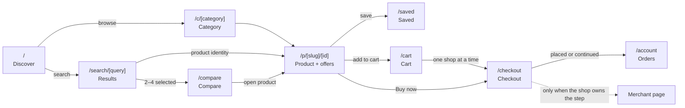
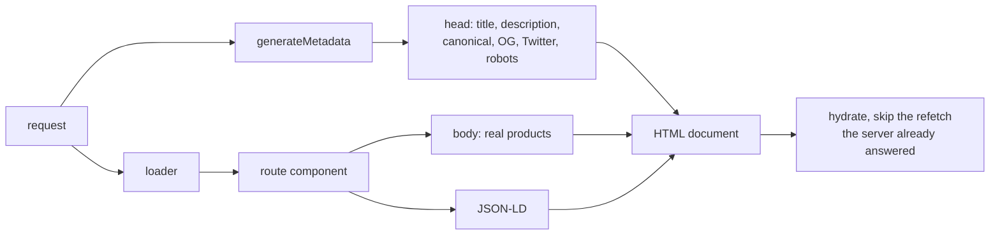
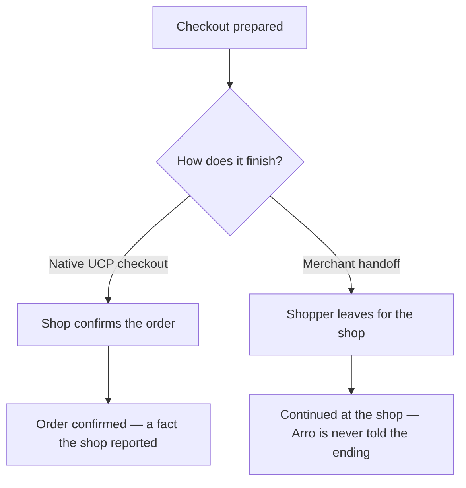
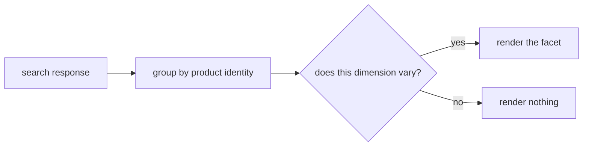

# Arro Frontend

The first-party app is a **shopping, price-comparison and decision surface**, not an admin dashboard.

The interaction reference is PriceRunner: search dominates the shell, category discovery is immediate, results are dense but calm, product identity is separated from merchant offers, and mobile is recomposed rather than squeezed. Arro takes those principles, not PriceRunner/Klarna branding, assets or merchant data. Source truth, merchant identity and Arro's authority model stay Arro-specific.

## Stack

```text
Expo SDK 57 · Expo Router 57 · React 19
React Native 0.86 + React Native Web
react-native-safe-area-context 5.7
@stripe/stripe-react-native 0.64 (iOS/Android PaymentSheet; Android Google Pay)
@google/react-native-make-payment 0.3 (Android native Google Pay)
Uniwind 1.10 / Tailwind CSS 4.3 · Zustand 5
@react-native-async-storage/async-storage 2.2 (device-local cart and saved list)
```

Expo Router is the navigation authority. Shopper pages are route-backed rather than hidden inside a Zustand `screen` enum.

`app.json` is also the native brand authority: a 1024 px Arro app icon, Android
adaptive-icon background, 512 px splash mark, white splash surface, package/bundle
identifiers, and the Google Pay environment config plugin are checked in. The
splash is owned by `expo-splash-screen`, not an improvised React loading page.

## Routes



| Route             | Rendering | Indexed             | Purpose                                                   |
| ----------------- | --------- | ------------------- | --------------------------------------------------------- |
| `/`               | server    | yes                 | search-first discovery and category entry                 |
| `/c/[category]`   | server    | known categories     | category landing: sub-categories plus a rail each         |
| `/search/[query]` | server    | curated queries only | product groups, facets, sort and compare selection        |
| `/p/[slug]/[id]`  | server    | yes                 | source-authoritative product detail and offer comparison  |
| `/cart`           | client    | no                  | cross-shop cart; one prepared checkout per shop           |
| `/saved`          | client    | no                  | saved decision state, revalidated when reopened           |
| `/compare`        | client    | no                  | bounded 2–4 comparison; the selected set is session-local |
| `/checkout`       | client    | no                  | focused purchase state; browsing chrome is hidden         |
| `/account`        | client    | no                  | identity, orders, lists, checkout details, device data     |
| `+not-found`      | server    | no (`follow`)       | recovery page with search and the category list           |

Indexable catalog routes carry a server `loader`, so their HTML contains real products before any JavaScript runs.

### URL shapes

`/search/coffee-machine` — a hyphenated slug, not a percent-encoded string. An encoded space does not survive the round trip between the URL and the loader key, and the slug reads better in a search result. Filters and sort stay in session state instead of multiplying the URL space, so every filter permutation collapses onto one canonical document.

`/p/aeropress-original-coffee-maker/c2hvcGlmeS…` — the slug is decoration; the trailing segment is the stable source and product identity encoded into one path-safe token. Variant selection is page state, not a second canonical document. Older links whose token also contains a variant still resolve, then canonicalize to the stable product URL. Identity is encoded by hand rather than through `Buffer` or `btoa` so it round-trips identically in the Node renderer, the browser and the native runtime.

## Server rendering, SEO and AEO

Web output is `server`, with `unstable_useServerDataLoaders` and `unstable_useServerRendering` enabled on the `expo-router` plugin. There is no separate web framework: the same React Native components render on the server.



`loader` runs per request and its result reaches the component through `useLoaderData`. Each screen accepts that result as a seed and skips the duplicate client fetch on hydration, so a cold visitor pays one round trip rather than two.

Category and search metadata are deterministic from the route and curated taxonomy. They do not repeat the loader's catalog fan-out just to write a title, and they do not claim a live product or shop count that could disagree with the body. Product metadata remains source-backed because its title, description and images are product facts.

### The document a crawler actually receives

React Native Web renders everything as `<div>` unless it is told otherwise, and a `Pressable` with an `onPress` is a dead end that only a browser running JavaScript can follow. Metadata and JSON-LD were correct while the body was structureless and unreachable — good head, invisible page.

Three things fix it, and all three are load-bearing:

| Need | Mechanism |
| --- | --- |
| Crawlable links | `ProductLink` renders a real `<a href>` on web and intercepts primary clicks for client-side navigation. Modified clicks and middle clicks belong to the browser. |
| Document outline | `role="heading"` with `aria-level` maps onto `<h1>`–`<h6>`; `main`, `navigation`, `banner`, `contentinfo`, `region`, `article`, `list` and `listitem` map onto their tags. |
| Indexable images | `ProductImage` renders a real `` on web with `alt`, `loading="lazy"` and `decoding="async"`. React Native Web otherwise paints a CSS background behind an empty-alt image. |

The results grid also disables virtualization on web. A crawler does not scroll, so a virtualized first window published four products out of twenty-six and truncated the crawl graph into the catalogue.

Every page ends with the same category footer. That is the internal-linking backbone: a crawler landing on any product still finds a path to every category. It is page **content**, at the end of the scroll — pinned to the viewport it would spend permanent real estate on links nobody is looking at yet.

A search page currently serves:

```text
41 links · 1 h1 · 28 h2 · 27 images with alt
main / nav / header / footer · 32 list items
```

### What is indexed

Known category pages and the bounded subcategory queries published in the sitemap are indexable. Arbitrary user-written searches are always `noindex, follow`, even when they return products, so the open-ended search space cannot become a crawl trap. Invalid category/product identities return HTTP 404; a valid route whose upstream catalog is temporarily unavailable returns HTTP 503. `/compare`, `/cart`, `/saved`, `/checkout` and `/account` are session or device state and are not indexed.

### Structured data

JSON-LD is emitted from a web-only component, since React Native has no `<script>` and the web renderer is react-dom.

| Route             | Types                                                             |
| ----------------- | ----------------------------------------------------------------- |
| `/`               | `Organization`, `WebSite` with a `SearchAction` for the sitelinks search box |
| `/search/[query]` | `CollectionPage` wrapping an `ItemList`, plus `BreadcrumbList`     |
| `/p/[slug]/[id]`  | `Product` with `AggregateOffer` or `Offer`, plus `BreadcrumbList` |

`CollectionPage.dateModified` is the **source fetch time, not the render time**. A page that claimed to be fresh because it was rendered a second ago would be the machine-readable version of a lie, and freshness is the one thing Arro is asking to be believed about.

`Offer.priceValidUntil` is emitted only when the source actually stated an expiry. A source that says when its answer stops being valid has stated a price validity window; inventing one would be the same mistake in the other direction.

`Offer.availability` is omitted when availability is `unknown`, and `itemCondition` is omitted for `unknown` or `open_box`. Schema.org has no exact open-box condition, so Arro does not relabel it as new.

`AggregateOffer` appears only when the compared offers share one currency; otherwise a single `Offer` is emitted. Structured data is generated from the same facts the page displays — a machine-readable claim that outruns the visible page teaches agents the wrong answer, which is worse than publishing nothing.

### Social and link cards

Bluesky, X and Mastodon all fetch `og:image` and size the card themselves, so the tags carry a title, description, unique images and an explicit `alt`.

Dimensions are deliberately **not** declared. Merchant images arrive at whatever size the shop published, so stating `1200x630` would be a machine-readable claim Arro cannot back — the same mistake as structured data that outruns the visible page. A card reader that measures the real image renders it correctly; one told the wrong size letterboxes it.

Robots directives are written into the main `robots` value rather than a googlebot-only tag, because that is the form every engine reads and the one that survives serialization: `index, follow, max-snippet:-1, max-image-preview:large`.

### Answer-engine surfaces

- `/robots.txt` — allows the browse surfaces, disallows session/device routes and Expo's internal sitemap screen, then points at the XML sitemap. Answer-engine crawlers are named and allowed explicitly: Arro's value is being cited correctly, and a model that cannot read the page will answer about Arro from somewhere else.
- `/sitemap.xml` — home, known category pages and the fixed set of subcategory searches. It does not emit render-time `lastmod` values or enumerate product pages: without a durable product inventory either would manufacture freshness or URLs the catalog cannot guarantee. Crawlers reach products through the listed browse pages.
- `/llms.txt` — a discovery hint that states what Arro is, how to read a source-labelled price, that a cart may span shops while a checkout never does, that any total Arro computes is a planning estimate, and where the authoritative UCP profile, OpenAPI and MCP endpoints live. The URL shapes in it are the real ones: a discovery file advertising a route the router does not serve teaches every reader a dead link. It is a hint, not access control; the UCP profile remains the capability authority.

## Design tokens

Tokens live in `apps/app/global.css` and are mirrored as hex in `src/lib/theme.ts` for React Native props that cannot read classes (icon tint, placeholder, `ActivityIndicator`).

| Group  | Tokens                                                                  |
| ------ | ----------------------------------------------------------------------- |
| Text   | `ink-950` primary · `ink-800` body · `ink-600` subtle · `ink-400` muted |
| Fills  | white page · `fill-soft` raised · `fill` sunken · `fill-strong`         |
| Lines  | `line` hairline · `line-strong`                                         |
| Brand  | `arro-50/100/500/600/700`                                               |
| Status | `positive` · `warning` · `danger`, each with a `-soft` surface          |

Type uses four weights only — 400, 500, 600, 700. No `extrabold`/`black`. Hierarchy comes from size and colour, which is what keeps a dense result grid readable. Sizes are drawn from a small set: 12/16, 13/18, 14/20, 15/20, 16/24, 18/24, 20/28, 24/32, 30/36.

Buttons and chips are pills (`rounded-full`); image tiles are `rounded-2xl`; sheets and cards are `rounded-3xl`. Shadows are reserved for overlays.

## Search and canonical product groups

The API returns source-labelled offer-like rows. The UI groups only on an identity the source already asserted:

```text
product-group key = businessId + productId

canonical product
  ├─ offer / seller A / variant X
  ├─ offer / seller B / variant Y
  └─ offer / seller C / variant Z
```

The representative card uses the best currently usable offer: available before unavailable, then lowest comparable price. Merchant count is deduplicated by seller identity.

**Do not fuzzy-merge unrelated sources by title, brand or image in the frontend.** Cross-source canonicalization needs a stronger product-identity layer; a visually convenient guess is not product truth.

## A category is not a search for its own name

Category links used to run a search for the category's own word, and every one of them landed on an empty page: shops sell *board games* and *building sets*, not "toys". `toys` returned nothing while `lego` returned results — a healthy catalogue rendering a dead end.

`/c/[category]` asks the questions the sources can answer instead. Its loader fans out over the first three sub-categories, bounded at three calls of eight items, drops any rail that came back empty, and puts the whole second level one tap away. The sitemap lists category pages and sub-category searches, because those are the pages that actually carry products for a crawler to reach.

The taxonomy is search intents, not facet counts. Arro does not own a catalogue and does not claim inventory for a node.

## A link has to lay out like a View — on both platforms

The web fix was one half. On native, `ProductLink` rendered Expo Router's `Link`, which is a **`Text`** — and a `Text` lays its children out *inline, like words*. Every flex utility was ignored: category tiles put their icon beside the label and pinned both to the top, product cards ran the image into the title, and card buttons landed on top of text.

It was invisible to every DOM measurement because the web build renders a real `<a>`. Native now renders a `Pressable`; crawlability is a web concern and the web keeps its anchor.

## Optional accounts

Arro shops without an account and always will — that is a product rule, not a gap. What an account adds is a cart and a saved list that follow someone to another device.

- Passwords are verified with `scrypt` from Node's standard library: random per-account salt, 64-byte derived key, no third-party hashing dependency to keep patched.
- Sign-in compares against a throwaway salt when no account exists, so a missing address and a wrong password cost the same wall-clock time.
- Failed attempts are counted and lock the account for fifteen minutes, then reset on success.
- Registration is the only endpoint that reveals whether an address is taken, because one address cannot belong to two people. Sign-in stays uniform.
- Signing in binds the existing signed shopper session to the account and records the binding, so signing out is a server-side revocation rather than a client forgetting a value.
- Google and Apple sign-in verify the provider's ID token against its published JWKS — signature, issuer, audience and expiry — before believing a single claim. Accounts link on the provider's stable **subject**, never the email, because an address can change hands and a subject cannot.
- A provider is offered only when the API holds a client ID to verify against *and* the bundle holds one to prompt with. `GET /v1/shopper/account/providers` reports what is live, so a button cannot appear against a server that would reject it.

The account session **is** the shopper session, so purchases made after signing in belong to the account rather than the device.

### The account page answers three questions

Who am I to Arro, what have I got in flight, and what does Arro hold about me.
Anything that cannot answer one of those does not belong on the page. Signed
out, the sign-in panel *is* the page and everything below still works without an
account; signed in, identity leads and the panel disappears rather than
lingering as a dead card.

The one field group Arro keeps for its own use is the contact block UCP puts on
a checkout, so it is not retyped at every shop. It saves as it is typed — an
earlier **Save** button wrote nothing the keystroke had not already written,
which is the kind of control that makes a page feel like a mock-up. There is
deliberately no address and no card: the shop's own checkout owns those, and
storing them would make Arro a payments processor.

### An order is only what Arro watched happen



Both outcomes are recorded, and they are labelled differently because they are
not the same claim. Writing a handoff down as a purchase would put orders in
someone's history that may never have happened. A later confirmation replaces
the earlier handoff on the same purchase ID rather than listing one checkout
twice, and the page says plainly that the shop's own confirmation email is the
real record.

## One frame, one left edge

Every page, the header and the footer measure from `Shell` in `components/Page.tsx`: one max-width, one gutter that grows 16 → 40px with the viewport. The wordmark, the breadcrumb, the page title and the first product in the grid all land on the same line down the left of the screen.

On a listing page the breadcrumb and title span the full frame and the filter column sits **below** them, not beside them — the title is about the page, not about the results area. That is also what every comparison and marketplace listing does, which is the whole argument for doing it.

When each surface picked its own max-width and padding, that line moved between pages by up to 250px. Nobody points at it; everybody feels it.

### A link has to lay out like a View

`ProductLink` renders a real `<a>` on web so a crawler can follow it. A bare anchor is `display: block` with a browser-blue underline, which means every flex utility handed to it — `gap`, `justify-center`, `items-center` — silently does nothing. Cards lost the gap between image and title; breadcrumb labels sat at the top of their box while the chevrons between them were centred.

The web anchor therefore carries React Native's View defaults: `display: flex`, `flex-direction: column`, `min-width: 0`, no underline, inherited colour. Direction and alignment stay out of it, so `className` still means the same thing on both platforms.

## Two shells, not one stretched composition

The phone and the pointer get different chrome, because they are different machines.

| | Phone (`< 768`) | Pointer (`≥ 1024`) |
| --- | --- | --- |
| Navigation | bottom tab bar: Discover, Search, Saved, Cart | header utility row plus a category nav strip |
| Search | full-screen surface with recent queries and category entry | inline field in the header |
| Categories | bottom sheet | mega-menu panel that drops out of the header |
| Filters | one sheet per facet | a rail that stays open beside the results |
| Overlays | bottom sheet, arriving from the edge it is dismissed towards | centred dialog — a panel pinned to the bottom of a 1400px window is a phone pattern wearing a desktop coat |
| Product card | save and add-to-cart | save, add-to-cart and compare |
| Product page | sticky price and buy bar; tab bar steps aside | sticky offer column beside the gallery |

The split is drawn in `lib/layout.ts`. `compact` means one thumb and no hover; `desktop` means a pointer, a keyboard and room for state to stay visible.

### What the server assumes about width

React Native Web has no window on the server, so the first render — the one that becomes the HTML document — has no viewport to measure. It commits to the desktop composition, because that is what a crawler, a link preview and a reader-mode pass render at, and corrects on the client before paint.

That decision lives in exactly one module-level store rather than in per-component state. Every component that asks about layout would otherwise carry its own copy of a single global fact.

Chrome that must be right in the served HTML — the tab bar, the footer — is switched with Tailwind's `md:` variants instead, so CSS decides it with no JavaScript and no flash.

## Results

The facet bar scrolls horizontally on phones; on a pointer layout the same facets live in a rail beside the grid, so a filter costs a click instead of a sheet.

```text
query                                    [Headphones]
33 products from 24 shops
Shopify Global Catalog · updated now
( Best match ) ( Price ) ( Currency ) ( Shop ) ( Rating ) →
┌──────────┬──────────┬──────────┬──────────┬──────────┐
│ image ⊕  │ image ⊕  │ image ⊕  │ image ⊕  │ image ⊕  │
│ shop     │ shop     │ shop     │ shop     │ shop     │
│ title    │ title    │ title    │ title    │ title    │
│ ★ 4.5    │ ★ 4.2    │ ★ 4.8    │          │ ★ 4.1    │
│ $129.95  │ from $45 │ $89.00   │ $199.00  │ $59.95   │
└──────────┴──────────┴──────────┴──────────┴──────────┘
```

Columns follow width: 1 below 380 px, then 2, 3 at 760, 4 at 1080, 5 at 1400. `⊕` is the compare toggle, overlaid on the image so it costs no vertical space.

### Facets are derived, never assumed

A control appears only when the returned facts make it able to change the result set.



Concretely: `Shop`, `Brand`, `Currency` and `Condition` appear only with more than one distinct value; `In stock` only when availability differs; `Rating` only when more than one result is rated. A "Condition" control over results that are all `new` is a tap that cannot help.

`Price` and `Brand` narrow at the source and refetch. `Shop`, `Currency`, `Rating`, `Condition` and `In stock` filter the loaded set. Filters apply to **offers**, and each group is rebuilt from the offers that survived, so a matching shop is never dropped because a different shop happened to be cheapest.

Price bounds carry the currency the shopper is looking at. Sending USD bounds against an AUD listing would filter the wrong numbers.

### Mixed currencies

Cross-currency comparison is not performed. When results span currencies, the app says so and offers the currency facet; picking one currency re-enables price sort. On product pages the majority currency ranks first and other currencies follow, so one foreign listing cannot scramble the order of every comparable offer.

### Continuation

**Show more products** renders only when the API returns `pageInfo.hasNextPage` with an opaque `nextCursor`. Continuation appends and deduplicates offers and keeps the rendered page if a later request fails. The cursor is never interpreted by the app. For federated pages Arro withholds continuation unless exactly one cursor-capable source backed the page — advancing several upstream cursors after a global top-N merge can skip candidates that were fetched but not surfaced.

## Why search carries `imageUrl` and `rating`

A comparison grid cannot afford one detail request per card.

```text
one catalog search              not:   search
  ├─ identity + image + rating           ├─ detail request for image/rating
  ├─ identity + image + rating           ├─ detail request for image/rating
  └─ identity + image + rating           └─ …
```

UCP/Shopify adapters therefore promote already-supplied primary media and rating into the validated summary contract.

## Product detail and offers

```text
gallery + thumbnails   │ brand
                       │ title
                       │ ★ 4.9 (4266)
                       │ ─────────────────────────
                       │ Across 10 shops
                       │ $39.95  to $49.99
                       │ Shopify Global Catalog · updated now
                       │ [ Buy with Arro ] [ Add to compare ]

Compare offers                                        10 offers
FreshGround Roasting   Lowest price                    $39.95  [Buy]
Brio Coffeeworks       In stock · New · updated now    $39.95  [Buy]
Phil & Sebastian       In stock · New · updated now    $41.00  [Buy]
…
Options · Product details · Where these prices come from · Before you buy
```

For Shopify Global Catalog a source result can already be a UPID-clustered product containing seller-bearing variants. The connector preserves those merchant offers; the UI groups them back under the authoritative product ID and lists them.

Detail responses carry no rating, so the rating the shopper already saw in results is reused rather than disappearing on navigation. Product options serve two purposes: single non-placeholder values remain useful specifications, while multi-value axes are interactive selectors. The selector preserves UCP option IDs and `available`/`exists` state, refetches detail with provider-neutral `selected` values, and renders the returned product-level `selected` values as the source-confirmed effective configuration.

A configurable product is not purchase-ready merely because the source returned a featured/default variant: buying the catalogue's default shoe size would ship a size nobody chose. An axis is settled when the shopper picked it, when Arro already holds a source-confirmed variant identity, or when every alternative on that axis is currently unavailable — an axis offering one purchasable value is not a decision, so the shopper is not asked to confirm it. Anything still open is named in the buy panel, and the CTA reads **Choose options** until it closes. If UCP relaxes or substitutes a requested value, the page remains usable but buy/cart stay blocked.

Availability is relative to the current configuration, so this is recomputed against every response rather than latched. Choosing a colour can make a second storage size sellable; the storage value that rode along as a carried default then becomes a real decision again and the CTA returns to **Choose options**. Arro keeps what the shopper chose apart from what it carried forward for that reason — a value is sent to the source to keep the configuration exact, not because anyone asked for it. Offers are narrowed to the effective configuration; a variant that names an axis and disagrees is a different SKU and never stands in, while a variant that never names the axis can, because a source that omits per-variant options would otherwise leave the shopper with no offers at all.

**Unconfirmed variants.** An aggregated catalog can answer detail from a different offer universe than the search result came from. When the source will not confirm the requested variant, the app retries without the variant, shows the offers the source _does_ confirm, says so, and keeps purchase actions blocked until an exact configuration is confirmed. It never presents another variant's price as the requested one.

The primary CTA is **Buy with Arro**. Merchant-hosted continuation is a step returned by the purchase state machine, not the default. The UI always names the shop, so Arro never masquerades as the merchant.

## Checkout review and native payment

The checkout screen renders the merchant's current state rather than a reduced
Arro form: line items and totals, buyer details, every delivery or pickup method,
destinations, fulfillment options and dates, merchant messages, links, and
policies. Input errors stay beside the affected section, disclosures remain near
the fact they qualify, and a blocking message cannot disappear behind a generic
error banner.

Every buyer/address/fulfillment change carries the exact checkout snapshot hash.
The API rejects stale edits, expands the requested change into the merchant's
full replacement shape, then returns a new authoritative snapshot and total for
review. Human confirmation is bound to that same snapshot, so an older approval
cannot silently survive a price, policy, buyer, or fulfillment change.

On iOS and Android, a negotiated live Stripe Processor Tokenizer action prepares
the merchant's native PaymentSheet for Visa/Mastercard; eligible Android devices
also receive Stripe Google Pay. The short-lived session is bound to the exact
checkout/action and only the PaymentIntent ID is submitted after confirmation.
If result delivery briefly fails, the same prepared action resubmits that ID
without reopening PaymentSheet. A separate Android `com.google.pay` action uses
Google's official control only after build, merchant request, installed adapter,
and `isReadyToPay()` agree. Cancellation returns to the intact checkout in both
paths. Web and unsupported native builds request the next explicit
merchant-declared fallback instead of pretending to run the provider. The
receipt unlocks only from a merchant `completed` checkout that contains an
Order.

The store persists only the active purchase ID. A just-prepared checkout may be
passed in memory to avoid one immediate read; after reload, suspension, or a deep
link, the screen reloads the merchant-backed state. Payment credentials are never
persisted in device storage.

## When a shop has no checkout to open

`prepare` answers even when it could not negotiate a checkout: the runtime returns its "no session" sentinel — `unknown-purchase`, an `unknown` merchant origin, no line items — together with the shop's own URL.

That is a handoff, not a checkout. Sending it to the checkout screen produces a 404 on an ID that never existed, which is exactly what it did. `isPreparedCheckout` separates the two, and a handoff surfaces as a sheet on the page the shopper is already on: it names the shop, says plainly that Arro cannot complete this order, and makes leaving an explicit choice. The scope rule is that a missing capability is made plain *before* checkout, not discovered as a failure inside one.

When the checkout **is** real, the prepared purchase is handed to the screen through a small store rather than re-read over the network. `prepare` returned the whole object a moment ago; fetching it again only adds a round trip to the slowest point in the flow.

## Cart

The cart spans shops. A checkout never does.

```text
cart (device-local)
  ├─ Whole Latte Love ──── 2 lines ─→ one prepared UCP checkout ─→ one merchant Order
  └─ Anthony Ryans ─────── 1 line  ─→ one prepared UCP checkout ─→ one merchant Order
```

This is not a display choice. A merchant Order is the only thing that completes a purchase, so the shape the cart groups into is the shape `POST /v1/purchases/prepare` accepts: `checkout.line_items` for one merchant, with `selectedOffer` alongside it because merchant resolution reads its seller hints.

- Each line keeps the offer snapshot it was added with, so the cart renders before any network call.
- Opening the cart revalidates every distinct product once — not once per line — and shows what changed: a price that moved, an offer the shop no longer sells. A source that cannot answer right now is not evidence an offer is gone, so the line keeps its last known state.
- A line the shop can no longer sell cannot reach checkout.
- Quantity is the one number the shopper edits directly, so it gets real targets and a decrement that removes the line at zero.

**Every total Arro computes is a planning estimate, and says so.** Arro adds prices only within one currency; across currencies it declines to produce a number rather than inventing an exchange rate. The authoritative total is the one the shop's own checkout returns, after shipping and tax.

## Saved

Saved products are decision state, not a wishlist widget:

- the search that led to the item is kept, so "why is this on my list?" still has an answer months later;
- reopening the list revalidates price and availability, bounded to the first 24 items;
- a product the shop stopped selling is **kept and marked**, showing the last snapshot Arro saw, rather than silently deleted;
- recently viewed products are recorded locally and capped.

Cart, saved, recently-viewed and order history all live in device storage — `localStorage` on web, AsyncStorage on native — and are read once on the client after first paint. The server renders an empty cart because that is genuinely all it knows. Hydrating from storage during render would either crash the server bundle or publish markup the browser instantly contradicts.

## Compare

Bounded to four candidates. One horizontally scrolling table serves every width: a sticky-width label column plus fixed-width product columns.

Rows: price, rating, availability, condition, brand, shop. A `Cheapest` badge appears only when every compared product is priced in one currency. Strengths/risks come from the compare API, not from frontend heuristics.

The compare route sends the normalized product facts already selected from search. It does not create a parallel frontend product model.

## Client state

```text
query / submitted query
sort / price range
selected product + known offers
compare set
```

Zustand owns ephemeral cross-route shopper state only. It does not own route identity and is not a server cache. Deep links must work by fetching from URL parameters.

## API client

`apps/app/src/api/client.ts` stays small: one bounded JSON helper; search, detail
and compare; a short-lived first-party shopper session for owner-scoped purchase
calls; prepare/read/review update/payment action/result/confirm/cancel; and
`AbortSignal` support. Server-rendered catalog reads add the server-only
`ARRO_FRONTEND_SERVER_TOKEN`; it is never bundled through `EXPO_PUBLIC_*`.

The shopper-session token grants purchase scopes only and is never an API-key substitute. Renewal preserves the same shopper owner while the current token is still valid, so an in-progress checkout does not silently change identity. Stale requests are aborted so an older response cannot overwrite a newer query.

```text
EXPO_PUBLIC_ARRO_API_URL
EXPO_PUBLIC_ARRO_SITE_URL
EXPO_PUBLIC_ARRO_CURRENCY
```

Web development may omit the API URL and use `http://localhost:3000`. Native devices must set a device-reachable URL; production builds must use the public HTTPS API origin. Production web also requires `EXPO_PUBLIC_ARRO_SITE_URL` as an origin-only public HTTPS URL; it is the authority for canonicals, JSON-LD, robots and the sitemap. Native never falls back to `localhost`, which would address the phone itself. `EXPO_PUBLIC_*` values are bundled and must never contain secrets.

Browser builds call the API cross-origin, so configure every exact origin — for
example `APP_ALLOWED_ORIGINS=https://app.example.com,http://localhost:8081` while
testing a public API from Expo web locally. Production accepts public HTTPS
origins and explicitly listed loopback HTTP origins; it never accepts `*`. The
API varies responses on `Origin`.

## Motion

One scale for everything that moves, in `lib/motion.ts`: 120 ms for press feedback, 200 ms for anything appearing or crossfading, 320 ms for sheets. One decelerating curve for entrances, one accelerating curve for exits. A sheet, a card and a price update therefore move like parts of the same object.

Four primitives cover the app:

| Primitive | Use |
| --- | --- |
| `Appear` | fade and rise on mount, for page sections and rows — never for an unbounded list, where a stagger stops reading as a flourish and starts reading as lag |
| `Tappable` | press spring on the control itself, so a card acknowledges the touch before the route resolves |
| `Swap` | crossfade when a number is *replaced* rather than edited — a revalidated price, a running total |
| `SaveButton` | the heart fills and kicks once, because the control is the only feedback a save can give |

**Reduced motion is read once into a module-level store.** A results grid renders a hundred pressables; giving each one its own media-query listener and its own state would put a hundred subscriptions behind a value that can only ever have one answer. Anyone who asked their system for less motion gets a still page — the web stylesheet's `prefers-reduced-motion` block wins over every animation on it.

A bottom sheet is two animations: the backdrop fades in place while only the sheet translates. Unmounting is driven by a timer rather than the animation callback, because animation progress depends on frames and a backgrounded tab stops producing them.

## Skeletons

A placeholder has one job: say "content is coming, and it will be this shape". A still grey box says the first half only, which is why it reads as a broken layout rather than a loading one.

Every skeleton is built from the real component's measurements — same aspect ratio, same line heights, same grid gaps — so nothing jumps when data lands. The web sweeps a CSS gradient, composited by the browser, so a full grid costs no main-thread work. Native breathes from **one shared driver**, so twenty placeholders cost one animation, and the loop stops when the last one unmounts.

The product page and checkout show their real shape while loading instead of a centred spinner.

## Carousel

One rail component serves the product gallery, the recently-viewed row, the saved row and the phone category strip: swipe on touch, snap to cells, arrows on a pointer device, and a position indicator — dots for a handful of cells, a proportional bar for more.

Scrolling drives an `Animated.Value`, not component state. A rail that re-rendered its cells on every scroll frame would repaint a row of product cards sixty times a second to move a four-pixel progress bar; only the page index, which changes a few times per swipe, is allowed to re-render.

Every cell stays in the document. A rail of products is a set of real links, and virtualising them would hide them from a crawler.

Two details that are easy to get wrong and were: `scroll-snap-type` belongs on the element that scrolls, not on the content wrapper inside it, where it is inert; and a rail that has not been measured yet must still render a truthful indicator, or the first paint collapses every rail to a single dot.

## Breadcrumbs

The trail a crawler reads and the trail a shopper sees are the same trail. `BreadcrumbList` structured data describing a path the page never renders is the same failure as any other machine-readable claim that outruns the document, so every crumb is a real anchor to a page that exists. On a phone the middle collapses rather than wrapping to three lines.

## Accessibility

Icon glyphs render as private-use font characters on native, so they leak into any accessible name computed from descendants. Buttons and chips therefore carry an explicit label derived from their own text. Interactive targets are at least 44 px, or 36 px with `hitSlop`.

React Native Web strips the browser's focus ring, which silently makes the whole app keyboard-hostile; the web stylesheet puts it back for keyboard users only.

`generateMetadata` runs on the server, so the title is correct on a cold load and then frozen. Every client-side navigation afterwards would leave the tab, the history entry and the screen-reader page announcement describing the page the visitor left, so screens set the document title on navigation. Only the title — canonical links, robots directives and structured data stay the server's business, because nothing a crawler reads should depend on a client effect having run.

## Performance rules

- no N+1 detail waterfall for search cards;
- group offers in one O(n) pass with maps/sets;
- results render through `FlatList`, so a long grid stays virtualized on native;
- keep compare selection bounded;
- abort stale network work;
- do not copy raw provider payloads into UI state;
- render source-authorized media directly instead of proxy-copying every image;
- no client-cache framework until request reuse actually needs one;
- one subscription per global fact, not one per component;
- nothing re-renders a list to animate a pixel.

### Hover answers, it does not rearrange

A product card does not jump, tilt or cast a shadow under the cursor. The image settles closer and the title picks up a rule. Shadow-lifting a borderless tile makes it look detached from the grid, and a grid that moves as the pointer crosses it is harder to scan, not easier.

### Icons are inline SVG on the web

`expo-symbols` draws web icons by downloading the **941 KB** Material Symbols variable font and rendering private-use characters from it. That costs the entire icon set before a single glyph appears, leaves every icon missing from the server-rendered HTML, and shifts the layout when the font finally lands.

The web build ships ~50 inline SVG paths instead — a few kilobytes, present in the first byte of the document, tinted from `currentColor`. Native keeps `expo-symbols`, where SF Symbols are a system resource and the Android font is already in the bundle.

One geometry for every icon: a 24px box, 1.75px strokes, round caps and joins. Consistency is what stops an interface built from fifty small marks looking like fifty different interfaces.

### Images ask the CDN for the size they will paint

Merchant media is served from the shop's own CDN and Arro renders it directly rather than proxy-copying it, which leaves exactly one safe optimisation: request the painted size.

`ProductImage` emits `srcset` and `sizes` whose breakpoints mirror the grid's column counts, so the browser fetches a ~320px candidate for a 180px tile instead of a 2000px merchant export. The transform is applied **only to hosts whose resizing contract is published**; appending a guessed parameter to an unknown host either does nothing or breaks the image, and a broken product photo is worse than a large one.

### `content-visibility` is deliberately rare

It skips layout and paint for off-screen sections, and it also removes them from rendered-text extraction. It belongs only on device-local content that no crawler or answer engine should be quoting anyway — never on a section Arro wants cited.

## Naming the source a shopper can act on

Every offer names the shop that sells it, and every price carries when it was last checked. What the UI no longer prints is the catalog adapter Arro reached that shop through.

That identity is real and auditable, and it stays in the API's source labels, source governance and audit records. It is not something a shopper can price against, compare or buy from — putting an adapter name on the most valuable line of the page spends it saying nothing. "Checked just now · every price names the shop it came from" is the same commitment, stated in terms the reader can use.

## Deliberately not faked

Price/stock watches, an order centre, collaborative lists and account continuity remain product extensions until their persistence and contracts exist. Facets are derived from returned source facts; Arro does not invent a PriceRunner-sized taxonomy or claim full-catalog facet counts it does not have.

The home page carries no merchandised product rail. Choosing which products to show a visitor who has not searched yet is a ranking decision, and Arro does not make one. What it does show is what this device has actually done: recently viewed, and still saved.

## Known upstream behaviour

Expo Router renders the whole app inside one React streaming-suspense boundary. The served HTML puts the tree in `<div hidden id="S:0">` with an inline `$RC(…)` script that moves it into `#root` during parsing, so the document a crawler parses is correct — but the hidden container is sometimes left behind in the DOM afterwards, leaving a detached duplicate tree. It predates this work (removing app-level components does not change it) and is invisible to layout, `innerText` and the accessibility tree.

## Release review checklist

- direct reload of `/`, `/search/…`, `/p/…/…`, `/cart`, `/saved`, `/checkout?id=…`;
- 320–430 px phone widths plus tablet and desktop; no horizontal overflow at any width;
- safe-area behaviour on iOS/Android;
- zero-result, loading skeleton, partial-source and network-error states;
- long titles, missing images, missing ratings, mixed currencies, unavailable offers;
- one-offer and multi-merchant product groups; unconfirmed-variant fallback;
- facet sheets: keyboard, scroll, backdrop fade independent of sheet motion, dismissal;
- compare add/remove limits and the cheapest badge only under one currency;
- prepare/read/confirm/cancel plus merchant handoff only when the purchase state returns it;
- checkout buyer fields, all delivery/pickup methods, address edit, option
  selection, message placement, policy links, stale-snapshot refresh, and changed
  totals;
- physical iOS and Android development/release builds: Stripe PaymentSheet
  Visa/Mastercard, Android Stripe Google Pay eligibility, provider cancel,
  opaque result submission, app/process restart, unknown-outcome reconciliation,
  and receipt only from merchant Order; test the separate direct Google Pay
  executor on Android only when its production merchant contract is active;
- multi-line checkout: two lines from one shop reach the merchant with the right quantities;
- cart revalidation: price moved, offer withdrawn, source unreachable;
- cart and saved list survive a reload, and render empty from the server;
- reduced-motion setting stills the page;
- accessibility labels, contrast, focus and touch-target sizing;
- production app icon, adaptive icon, splash sizing, and no launch flash at phone
  and tablet aspect ratios;
- web CORS and native API-base configuration.
