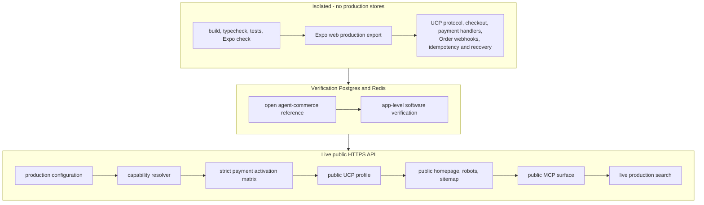

# Arro Production Operations

**Status:** Production/beta operating guide. Repository launch paths are
implemented and locally verified; deployment-account, DNS, merchant, provider,
and physical-device activation are external release work until their evidence is
captured.
**Scope:** Environment separation, release, sources, payments, retention, data rights, monitoring, support and recovery.

| Launch layer           | Current state                                  | Completion evidence                                                                                      |
| ---------------------- | ---------------------------------------------- | -------------------------------------------------------------------------------------------------------- |
| Repository             | Ready                                          | consolidated build/typecheck/tests and production SSR export pass                                        |
| Render/Vercel/DNS      | Not performed by source code                   | public HTTPS readiness, SSR, robots, sitemap, and UCP discovery checks pass on the bound domains         |
| Native binaries        | Source complete; device build not performed    | physical iOS and Android builds open live PaymentSheet and return through `arro://checkout`               |
| Production payment     | Needs launch merchant/provider                 | controlled live Visa/Mastercard payment, cancellation/recovery, capture/refund, and merchant Order       |
| Public traffic         | Blueprint uses paid always-on data/compute     | public monitoring plus measured load and recovery capacity                                                |

## 1. Environment model

Maintain separate environments for:

```text
local development
team/staging preview
production
launch verification stores
```

Do not share production secrets, API keys, payment credentials or databases with local/team preview.

A stable named Cloudflare Tunnel can front local/team ingress while Arro is hosted on a developer machine. Tunnel credentials and process lifecycle are machine infrastructure, not repository scripts. Production availability still requires an always-on origin and durable data services.

## 2. Production base configuration

Core values include:

```text
NODE_ENV=production
PUBLIC_BASE_URL=https://api.example.com
DATABASE_URL_FILE=/protected/runtime/database-url
REDIS_URL=...
API_KEY_PEPPER_FILE=/protected/runtime/api-key-pepper
AGENT_SESSION_SIGNING_SECRET_FILE=/protected/runtime/agent-session-signing-secret
ARRO_FRONTEND_SERVER_TOKEN_FILE=/protected/runtime/frontend-server-token
UCP_PLATFORM_SIGNING_PRIVATE_JWK_JSON=<protected-inline-EC-P-256-private-JWK>
# or UCP_PLATFORM_SIGNING_PRIVATE_JWK_FILE=/run/secrets/ucp-platform-signing-private.jwk
```

When payments/direct actions are enabled, configure the relevant signing/encryption/provider values rather than turning on every route by default.

Use a secret manager or protected deployment environment; `.env` is a local configuration format, not a recommended shared secret-distribution mechanism.

### UCP identity provisioning and rotation

Generate and version the dedicated EC P-256 private JWK in the deployment secret
manager. Configure exactly one protected source:
`UCP_PLATFORM_SIGNING_PRIVATE_JWK_JSON`, or a read-only mounted file through
`UCP_PLATFORM_SIGNING_PRIVATE_JWK_FILE`. The Render Blueprint uses the protected
inline secret because Blueprint services do not mount an arbitrary secret file.
The API publishes public-only material; the private `d` member must never enter
source control, logs, profiles or `EXPO_PUBLIC_*` configuration.

For zero-downtime rotation, prepublish the next public key, deploy and verify both
supported profile aliases, wait through the advertised profile cache TTL, then
promote the new private signer. Retain the previous public key long enough for
cached profiles and in-flight retries. If private material is exposed, revoke it
immediately through the secret manager and reject its `kid` rather than using the
normal overlap window.

### Local container and database boundary

Compose binds PostgreSQL, Redis, and the API only to `127.0.0.1`; the public path
must traverse the HTTPS tunnel. All services use `restart: unless-stopped`, and
the API health gate probes `/health/ready` rather than liveness alone. The image
runs the server directly as the unprivileged `node` user. `compose.yml` is the
local-development baseline. For a production-mode public tunnel, layer
`compose.production.yml`; it replaces inline development credentials with
read-only Docker secrets for PostgreSQL, the API database URL, API/session
secrets, the frontend server token and the UCP signing identity. Health responses
are outwardly `no-store`, while the API coalesces dependency checks into a
one-second snapshot to bound public probe load.

### Cloudflare crawler and robots policy

The origin `/robots.txt` cannot override a stricter Cloudflare managed response.
For the public API hostname:

1. disable the managed robots training override, or configure it to preserve the
   origin response;
2. in AI Crawl Control, allow every named agent in the origin `robots.txt`;
3. disable **Block AI Bots**, or add exact allow rules for those agents;
4. deploy the origin routes, then purge `/`, `/robots.txt`, `/sitemap.xml`, and
   `/.well-known/ucp` from the Cloudflare cache;
5. fetch `/`, `/robots.txt`, and `/.well-known/ucp` with every named user agent,
   including UCP Checker's documented `UCPCheckerBot/1.0` request identity,
   and require HTTP 200 without redirects;
6. run `node --env-file=.env apps/api/src/verify-public-discovery.ts` before
   rerunning external discovery checkers.

To isolate the origin from edge policy while retaining production canonical URL
assertions, set `VERIFY_PUBLIC_DISCOVERY_REQUEST_BASE_URL=http://127.0.0.1:3000`.
The public run must still execute without that override. `verify:launch` rejects
the override so the canonical production gate cannot accidentally certify only
the loopback origin.

Do not mark this complete while the raw public `robots.txt` contains a root
`Disallow` for any named agent, even if a third-party score overlooks it.

## 3. First-party app configuration

The Expo bundle needs only public configuration, for example:

```text
EXPO_PUBLIC_ARRO_API_URL=https://api.example.com
EXPO_PUBLIC_ARRO_SITE_URL=https://app.example.com
EXPO_PUBLIC_ARRO_CURRENCY=USD
```

Never place backend/payment secrets in `EXPO_PUBLIC_*`.

Production launch verification exports the frontend with `PUBLIC_BASE_URL` as its API URL and requires a separate origin-only public HTTPS `EXPO_PUBLIC_ARRO_SITE_URL` for canonical links, JSON-LD, robots and the sitemap. The launch gate rejects missing, local, IP-based or path-bearing site origins so `localhost` cannot accidentally be baked into the release build.

### Vercel frontend and Render API

Create the Vercel project with **Root Directory** set to `apps/app`. The checked-in
`vercel.json` exports the Expo Router server bundle, serves `dist/client` through
Vercel's CDN, and rewrites application requests to the official `expo-server`
Vercel adapter. Do not deploy `dist/client` as a static-only site: SSR routes,
loaders, `robots.txt`, and `sitemap.xml` require the `dist/server` function.

Enable **Include source files outside of the Root Directory in the Build Step**
in Vercel. The app is an npm workspace: its lockfile is at the repository root
and it imports `packages/contracts`, so a build restricted to `apps/app` is not a
complete checkout of the application.

Use Vercel Node 24.x for the frontend function. `apps/app/package.json` pins that
exact major, while the Render API image remains pinned to Node 26.8.2. This keeps
each deployment on the runtime it actually builds against.

For the launch domain in this repository, bind:

```text
Vercel project domain: atishghimire.com.np
EXPO_PUBLIC_ARRO_SITE_URL=https://atishghimire.com.np
EXPO_PUBLIC_ARRO_API_URL=https://api.atishghimire.com.np

Render API custom domain: api.atishghimire.com.np
PUBLIC_BASE_URL=https://api.atishghimire.com.np
APP_ALLOWED_ORIGINS=https://atishghimire.com.np,https://www.atishghimire.com.np,http://localhost:8081,http://127.0.0.1:8081
```

The checked-in `render.yaml` is intentionally the shortest **temporary staging**
path. One Blueprint creates free `arro-api`, `arro-postgres`, and
`arro-key-value` resources in Singapore, wires their private URLs, and generates
ordinary API/session secrets. Render prompts for only one protected value:
`UCP_PLATFORM_SIGNING_PRIVATE_JWK_JSON`, a dedicated EC P-256 private JWK. Do not
also set its file form.

This staging Blueprint runs real catalog discovery and real merchant UCP
cart/checkout construction. It leaves `PAYMENTS_ENABLED` and every payment
executor off, so it neither requests fictional provider secrets nor advertises a
native payment capability it cannot execute. Shopify's documented anonymous tier
works without credentials. If Shopify grants this platform token-tier access,
add `SHOPIFY_AGENT_CLIENT_ID` and `SHOPIFY_AGENT_CLIENT_SECRET` together in the
Render dashboard; Arro obtains and refreshes the token at runtime.

Once Render has created `ARRO_FRONTEND_SERVER_TOKEN`, copy its exact value into
Vercel as the server-only `ARRO_FRONTEND_SERVER_TOKEN` for every environment that
will server-render against this API. It authenticates SSR catalog reads; it must
not have an `EXPO_PUBLIC_` prefix. Configure Vercel with:

```text
EXPO_PUBLIC_ARRO_SITE_URL=https://atishghimire.com.np
EXPO_PUBLIC_ARRO_API_URL=https://api.atishghimire.com.np
EXPO_PUBLIC_ARRO_CURRENCY=USD
GOOGLE_PAY_ENVIRONMENT=PRODUCTION
ARRO_FRONTEND_SERVER_TOKEN=<the exact Render-generated value>
```

When promoting beyond temporary staging, one launch merchant's two payment JSON
values have this shape. Add them as protected Render environment values, add
`PAYMENT_CREDENTIAL_ENCRYPTION_KEY` and `PAYMENT_ACTION_SIGNING_SECRET`, then set
`PAYMENTS_ENABLED=true` and `PROCESSOR_TOKENIZER_ENABLED=true`. Replace every
`merchant.example` value and identifier with the merchant's published contract;
never put the bearer token in the handler specification:

```json
[
  {
    "adapterKind": "processor_tokenizer",
    "handlerName": "com.merchant.stripe",
    "platformHandlerId": "arro_stripe_payment_sheet",
    "versions": ["2026-08-25"],
    "specification": "https://merchant.example/ucp/payment-handlers/com.merchant.stripe",
    "schema": "https://merchant.example/ucp/payment-handlers/com.merchant.stripe/schema.json",
    "environment": "PRODUCTION",
    "availableInstruments": [{ "type": "card" }],
    "handlerConfig": {
      "gateway": "stripe",
      "credential_type": "stripe_payment_intent",
      "merchant_info": { "account_reference": "merchant-owned-stripe-account" },
      "endpoints": {
        "native_session": "https://merchant.example/ucp/payment-handlers/com.merchant.stripe/native-session",
        "tokenize": "https://merchant.example/ucp/payment-handlers/com.merchant.stripe/tokenize"
      }
    }
  }
]
```

```json
{
  "https://merchant.example": {
    "provider": "com.merchant.stripe",
    "environment": "PRODUCTION",
    "bearerToken": "merchant-runtime-secret"
  }
}
```

The merchant `native_session` endpoint receives a request like this and creates
the PaymentIntent with the same idempotency key Arro sends in the HTTP header:

```json
{
  "provider": "stripe",
  "environment": "PRODUCTION",
  "binding": {
    "type": "dev.ucp.shopping.checkout",
    "id": "checkout-id",
    "snapshot_hash": "sha256:...",
    "action_id": "arro_pa_...",
    "merchant_origin": "https://merchant.example"
  },
  "amount": 1495,
  "currency": "USD",
  "capture_method": "manual",
  "payment_method_types": ["card"],
  "allowed_card_brands": ["visa", "mastercard"],
  "expires_at": "<signed-action-expiry>",
  "return_url": "arro://checkout",
  "merchant": { "account_reference": "merchant-owned-stripe-account" }
}
```

It returns only a live, matching session:

```json
{
  "provider": "stripe",
  "livemode": true,
  "publishable_key": "pk_live_...",
  "payment_intent_client_secret": "pi_..._secret_...",
  "payment_intent_id": "pi_...",
  "stripe_account_id": "acct_...",
  "merchant_display_name": "Merchant name",
  "merchant_country_code": "US",
  "currency": "USD",
  "amount": 1495,
  "capture_method": "manual",
  "payment_method_types": ["card"],
  "expires_at": "<same-or-earlier-expiry>"
}
```

After native confirmation, `/tokenize` receives the same checkout/action binding
plus `credential: { type: "stripe_payment_intent", reference: "pi_..." }` and
returns `{ "token": "opaque-checkout-token" }`. Before returning it, the
merchant must verify live mode, account ownership, PaymentIntent state, amount,
currency, checkout/action binding, and that the token can be consumed only for
that participant and checkout. Capture remains a merchant operation associated
with authoritative UCP completion; a PaymentSheet callback alone must not place
the order.

Set both `EXPO_PUBLIC_*` variables in every Vercel **Production**, **Preview**,
and **Development** environment that will actually be used; the same scoped
values are available while Vercel builds and while its function renders. A
production export now fails immediately instead of silently targeting localhost
when the API origin is absent.

The exact `APP_ALLOWED_ORIGINS` above permits the launch domains and Expo's two
local web origins during temporary staging. Remove the loopback entries when the
public API no longer needs to serve local browser builds. If a Vercel Preview
will be tested in a browser, give that branch one stable exact alias (for example
`preview.atishghimire.com.np`) and add its HTTPS origin. Do not wildcard every
`vercel.app` deployment.

Choose the Render service region first, then select the nearest available Vercel
Functions region in project settings. The SSR loaders call Render before they
can render catalog pages, so keeping the function and API near each other avoids
an unnecessary network leg. Point the apex domain to Vercel using the exact DNS
records Vercel supplies, and point the `api` subdomain to Render using Render's
supplied CNAME. A hostname can target the local Cloudflare Tunnel or Render, not
both: remove its Tunnel route before adding the Render CNAME. With Cloudflare
DNS, leave that CNAME DNS-only until Render has verified the domain and issued
its certificate; proxy it only afterward if desired. Keep the database, Redis,
signing keys, provider keys, and encryption material only on Render.

The Blueprint publishes no payment handler and leaves the separate direct
`com.google.pay` route disabled. After a real Stripe contract is activated,
eligible Android devices can surface Google Pay inside PaymentSheet. Direct
`com.google.pay` has separate production onboarding and must not be enabled with
example gateway values.

The free topology is appropriate only for integration testing. Under Render's
[current free-instance limits](https://render.com/docs/free), the API may spin
down after inactivity, free Postgres expires after 30 days and has no backup, and
free Key Value is memory-only and loses data on restart. Before accepting real
payment traffic, upgrade the API to always-on compute, Postgres to a backed-up
paid plan, and Key Value to a persistent paid plan. A volatile staging cache is
acceptable because direct payment credentials are disabled there. The plan IDs
and `persistenceMode: off` follow Render's current
[Blueprint schema](https://render.com/docs/blueprint-spec).

### Temporary staging order

1. Generate one EC P-256 private JWK in trusted local/secret tooling and keep the
   entire JSON object ready for the protected Render prompt. Never commit it.
2. Create a Render Blueprint from the repository root `render.yaml`, supply that
   one protected value, and wait for
   `https://<render-host>/health/ready` to become healthy.
3. Reveal/copy the Render-generated `ARRO_FRONTEND_SERVER_TOKEN` into Vercel as a
   server-only value. Set the Vercel values shown above.
4. Create/deploy the Vercel project from `apps/app`, with outside-root source
   inclusion enabled. Confirm the deployment serves SSR rather than only
   `dist/client`.
5. Add `api.atishghimire.com.np` to Render and `atishghimire.com.np` to Vercel,
   then create exactly the DNS records each provider displays. Wait for both
   platforms to issue HTTPS certificates.
6. Verify `/health/ready`, `/.well-known/ucp`, and a non-charging
   `/v1/purchases/prepare` against a live merchant on the API domain; verify `/`,
   `/robots.txt`, `/sitemap.xml`, `/llms.txt`, and a direct product/search reload
   on the frontend domain. Check that canonical URLs and application API calls
   resolve to the two public domains rather than a localhost fallback.

For payment go-live, first obtain the launch merchant's live Stripe contract and
implement its idempotent `native_session` and `/tokenize` endpoints. Upgrade the
three Render resources, activate the exact handler and secrets above, then build
new iOS and Android binaries; native Stripe modules do not run in Expo Go.
Complete a controlled low-value live Visa/Mastercard purchase on both, verify
Android Stripe Google Pay where eligible, and require the merchant's final Order
before treating the run as successful.

## 4. Database release

The production Docker entrypoint validates configuration, acquires the PostgreSQL
migration lock, applies every migration through `057`, and starts listening only
after the schema is current. Simultaneous instances serialize on that lock. It
then starts retention once and repeats it every six hours.

`db:migrate` remains useful for local work and an explicit migration diagnostic.
It needs either `DATABASE_URL` or `DATABASE_URL_FILE` plus the SQL migration
directory and never seeds catalog/source state. For local development, copy
`.env.example` to `.env`; Node 26 loads that optional root file. Production should
inject `DATABASE_URL` through the deployment environment or mount a protected
single-line URL file and set `DATABASE_URL_FILE`.

For a local/manual migration check:

```bash
npm run db:migrate
```

Current migration history is ordered through `057`.

Production procedure:

1. back up / verify managed backup status;
2. deploy the application; its production entrypoint applies migrations under
   the lock before accepting traffic;
3. verify migration checksums/history and `/health/ready`;
4. run the critical public smoke checks.

Do not run destructive experimental SQL manually outside the migration history.

## 5. Source activation

Shopify Global Catalog broad discovery is Arro's built-in baseline catalog source.
`CATALOG_ADAPTERS_JSON` is an explicit registry override, not a prerequisite for
normal product search; set it to `[]` only when catalog access is intentionally
disabled. Additional direct UCP, Shopify Storefront, or approved-feed adapters can
replace the baseline registry when needed.

For production, `PUBLIC_BASE_URL` must be the public HTTPS Arro API origin so the
derived `/.well-known/ucp` platform profile is a real external identity.

Activate custom source adapters only when they have:

- correct endpoint/source identity;
- required auth secret present;
- safe URL/network behavior;
- expected product normalization;
- current source/governance state where used;
- production-search verification.

A source used only for discovery does not automatically receive purchase authority.

## 6. Payment activation

Arro-rendered UCP checkout is the first-party path. Live Stripe PaymentSheet is
the primary native payment surface on iOS and Android; it accepts Visa and
Mastercard, and exposes Google Pay on eligible Android devices. Merchant-hosted
continuation is the broad fallback when the exact merchant handler or native
executor is unavailable, or when the merchant requires escalation.

Optional direct routes are enabled individually:

- trusted host;
- Stripe-backed Processor Tokenizer and native PaymentSheet;
- Android native Google Pay;
- Arro-hosted Google Pay Web fallback;
- AP2 when negotiated/configured;
- Embedded Checkout host/session binding;
- exact x402/MPP contract where advertised.

Do not enable a route because code exists. Enable it because the exact production tuple exists:

```text
merchant
+ handler/protocol
+ environment
+ credentials/keys
+ origin
+ user/delegated authority
+ merchant-Order activation evidence
```

Stripe has no standalone Arro switch. Configure it only through the exact
merchant-owned Processor Tokenizer handler and private endpoint credentials;
do not invent a generic or reusable Stripe credential.

## 7. Strict payment evidence

When an advertised direct route is part of launch, strict activation requires route-specific evidence with a merchant-authoritative Order.

Potential evidence-file variables include:

- `TRUSTED_HOST_ACTIVATION_EVIDENCE_FILE`;
- `AP2_ACTIVATION_EVIDENCE_FILE`;
- `GOOGLE_PAY_NATIVE_ACTIVATION_EVIDENCE_FILE`;
- `GOOGLE_PAY_WEB_ACTIVATION_EVIDENCE_FILE`;
- `PROCESSOR_TOKENIZER_ACTIVATION_EVIDENCE_FILE`.

A payment sheet success/redirect/provider session is insufficient.

## 8. Verification stores

Production launch verification uses isolated Postgres/Redis for software verification:

```text
VERIFICATION_DATABASE_URL
VERIFICATION_REDIS_URL
```

These must not equal production stores because software verification creates reference transactions and consume-once credential state.

## 9. Canonical release sequence

From the release commit:

```bash
nvm use
npm ci
npm run clean
npm run check
npm test
npm run check:app
npm run db:migrate
npm run verify:launch -- --plan
```

Then, with the public production API and exact production env active:

```bash
npm run verify:launch
```

Launch verification runs in three bands, and stops at the first failure:



The reference band writes transactions and consume-once credentials, so it uses `VERIFICATION_DATABASE_URL` and `VERIFICATION_REDIS_URL` and refuses to run against the production stores. The live band requires the public API to already be serving at `PUBLIC_BASE_URL`.

## 10. Dependency security

The repository has one dependency graph. Run the production audit independently in CI:

```bash
npm audit --omit=dev --audit-level=high
```

Do not blindly run `npm audit fix` in production. Identify the advisory, runtime reachability, patched version and compatibility impact.

## 11. Process lifecycle

Production API should run under a supervisor/container platform that provides:

- automatic restart;
- start after host reboot;
- environment/secrets injection;
- health checks;
- graceful termination;
- structured logs;
- deployment rollback.

The repository Compose file supplies restart-after-reboot behavior for the API
and data services. The `cloudflared` process must separately run under its system
service or another restart-enabled supervisor; a foreground terminal command is
only a smoke-test launcher, not production availability.

`SHUTDOWN_GRACE_PERIOD_MS` defaults to 25 seconds. Compose grants 35 seconds,
which must remain longer than the app drain budget.

## 12. PostgreSQL operations

PostgreSQL is the durable commerce state.

Monitor:

- connection usage/pool waiting;
- disk/storage growth;
- backup status;
- slow queries;
- migration status;
- dead tuples/vacuum where relevant;
- lock waits;
- replication/managed-service health if used.

Remember that `POSTGRES_POOL_MAX` is per API process.

Backups are not proven until a restore has succeeded.

## 13. Redis operations

Redis stores ephemeral/bounded runtime state, including consume-once encrypted payment credentials and rate-limit state.

Monitor:

- availability;
- memory/evictions;
- latency;
- key expiry behavior;
- credential-vault failures.

Redis loss must create a safe reacquire/blocker path, never an invented payment completion.

## 14. Retention

Current cleanup behavior includes:

- request audit retention;
- search/product-detail audit retention;
- expired commerce-memory proposal cleanup (dependent lineage cascades);
- completed/canceled UCP purchase-session retention with dependent purchase/payment/Order/AP2/embedded state cascading;
- discovery-observation retention;
- source-governance transitions are durable authority history and are intentionally not scanned/deleted by routine retention cleanup.

The production entrypoint applies retention once after startup and then every six
hours. Operators do not need a separate scheduled command. The workspace command
is the safe diagnostic/manual control instead of table deletes: it defaults to a
dry run and reports matched rows per table; `--apply` performs the same cleanup.

```bash
npm --workspace @arro/api run retention:cleanup
```

```bash
npm --workspace @arro/api run retention:cleanup -- --apply
```

`PURCHASE_SESSION_RETENTION_DAYS` controls cleanup of completed or canceled `ucp_checkout_sessions`. The removed `decision_receipts` and `checkout_attempts` tables have no retained runtime configuration aliases; production configuration names describe the current data model directly.

## 15. Data rights

Current protected routes include:

- `/v1/data-rights/access`;
- `/v1/data-rights/export`;
- `/v1/data-rights/corrections`;
- `/v1/data-rights/delete`.

Current data-rights export/access state is built from:

- UCP checkout sessions;
- UCP payment results;
- UCP Orders;
- data-rights event ledger.

Opaque external subject references are used for scoped HMAC lookup and are not echoed as raw stored identifiers.

Correction/deletion should preserve the minimum event/audit record needed to explain that the data-rights operation happened without retaining unnecessary deleted commerce payloads.

## 16. Logging and evidence

Structured logs should preserve operational evidence without leaking secrets.

Useful fields:

- request/correlation ID;
- integration/principal scope;
- merchant/source identity;
- purchase/checkout/order IDs where safe;
- operation type;
- reason/error code;
- elapsed time;
- source/provider class.

Never log:

- PAN/CVV;
- reusable wallet secrets;
- private keys;
- raw provider credentials;
- full sensitive buyer payloads by default.

## 17. Monitoring minimum for beta

Before opening meaningful traffic, monitor at least:

- API uptime/readiness;
- 4xx/5xx rate;
- p50/p95/p99 latency;
- connector latency/error/429 rate by source;
- Postgres connections and slow queries;
- Redis errors/latency;
- process CPU/RSS/event-loop health;
- purchase confirmations/completions;
- purchases stuck in unknown/pending states;
- webhook failures;
- duplicate/reconciliation events;
- merchant Order completion rate;
- frontend error reporting if available.

## 18. 1,000-user beta posture

1,000 registered users is not inherently a scale problem. Concurrency and request mix determine load.

A reasonable initial architecture is still:

```text
Cloudflare / HTTPS ingress
       ↓
1–few stateless API processes
       ↓
production PostgreSQL
production Redis
       ↓
merchant/provider APIs
```

Do not add Kubernetes/multi-region/distributed DB solely because the account count is 1,000.

Use staged rollout because production merchant/payment behavior is the unknown:

```text
25–50
→ 100–200
→ 500
→ 1,000
```

## 19. Load test

Before broad beta, run production-like traffic with test/reference payment completion.

Suggested progression:

- 50 concurrent users for sustained traffic;
- 100 concurrent users;
- short 200 concurrent user spike.

Exercise search/detail/compare/purchase prepare/get/idempotent retry/MCP. Do not mass-charge real payment methods.

See [PERFORMANCE.md](PERFORMANCE.md).

## 20. Incident controls

Keep the ability to disable risky writes/direct completion quickly without taking catalog read traffic down.

During an incident:

1. identify source/provider/route scope;
2. stop/disable affected direct payment/autonomous route;
3. preserve merchant-hosted continuation if safe;
4. reconcile ambiguous purchases before retrying;
5. record request/purchase/order IDs;
6. communicate exact user impact;
7. restore only after authoritative state is understood.

## 21. Unknown-outcome procedure

If a merchant write times out after request transmission:

```text
DO NOT immediately repeat completion
        ↓
GET/retrieve current checkout
        ↓
Order exists? → persist/return it
still in progress? → wait/reconcile
safe retry state? → retry with same idempotency semantics
cannot determine? → explicit blocker/support
```

This is a product correctness requirement, not merely an SRE concern.

## 22. Real-money smoke before beta

Before inviting external users, exercise at least one real supported flow:

```text
real search
→ real product
→ real merchant checkout
→ real payment/merchant continuation
→ merchant Order
→ Order retrieval
```

Also test, where supported:

- cancellation;
- one refund/return lifecycle or merchant support handoff;
- webhook/order update;
- timeout/retrieval recovery;
- duplicate/idempotent replay behavior.

Start with low-value controlled transactions.

## 23. Support minimum

You do not need an enterprise support platform for the first beta. You do need a reliable path to investigate:

- charged but no Order;
- duplicate/ambiguous purchase;
- payment pending;
- cancellation/refund issue;
- wrong product/source mismatch;
- account/API access problem.

Support tooling should retrieve current source/purchase/Order state by safe identifiers rather than ask the user to paste payment credentials.

## 24. Expansion/market operations

New markets require more than translation. Verify:

- sources/merchants actually serve the market;
- currency and minor units;
- address/fulfillment behavior;
- payment-handler availability;
- source disclosures;
- restrictions;
- cancellation/return/support expectations;
- operational support coverage.

Do not market “global” as all countries/merchants. Publish actual supported combinations.

## 25. Cleanup and generated artifacts

Before release:

```bash
npm run clean
```

This removes generated build state that can survive copied/ZIP workspaces and should not be treated as source.

Generated `dist`, `.expo`, TypeScript build info and local tunnel/runtime files must not become release authority.
