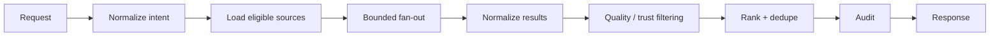
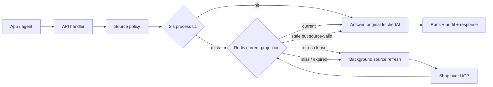
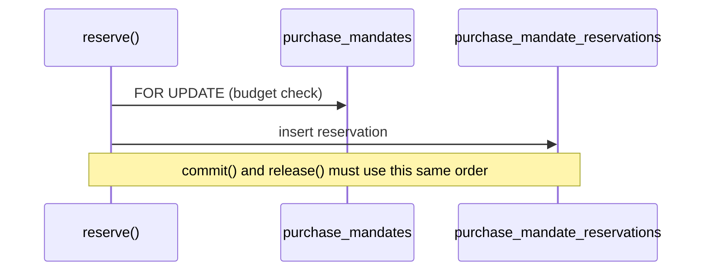

# Arro Performance, Runtime and Quality Engineering

**Status:** Production engineering source of truth
**Goal:** Keep the hot path simple, bounded, observable and fast before adding infrastructure.

## 1. Performance doctrine

Arro is a network-heavy commerce orchestrator. Most latency comes from some combination of:

- merchant/source fan-out;
- DNS/TLS/network setup;
- remote merchant response time;
- PostgreSQL state transitions;
- payment/provider round trips;
- client rendering.

The correct optimization sequence is:

```text
measure
  ↓
find dominant wait/allocation/query
  ↓
remove unnecessary work
  ↓
bound concurrency / reuse connections
  ↓
fix query/index shape
  ↓
cache only when freshness semantics are explicit
  ↓
add infrastructure only when the simpler system is measurably insufficient
```

Do not use architecture complexity as a substitute for profiling.

## 2. Current runtime posture

Current production-oriented defaults from `.env.example`:

| Setting | Default | Purpose |
|---|---:|---|
| `POSTGRES_POOL_MAX` | `10` | DB connections per API process |
| `POSTGRES_POOL_IDLE_TIMEOUT_MS` | `30000` | release idle connections |
| `POSTGRES_STATEMENT_TIMEOUT_MS` | `30000` | bound SQL execution |
| `MAX_REQUEST_BODY_BYTES` | `1048576` | bound request memory |
| `REQUEST_TIMEOUT_MS` | `30000` | whole-request budget |
| `CONNECTOR_TIMEOUT_MS` | `10000` | one connector call budget |
| `CATALOG_HTTP_MAX_CONNECTIONS_PER_ORIGIN` | `64` | HTTP connection reuse/cap per origin |
| `CATALOG_CONNECTOR_MAX_SOURCES_PER_REQUEST` | `5` | bound discovery fan-out |
| `CATALOG_CONNECTOR_MAX_CONCURRENCY_PER_REQUEST` | `3` | bound concurrent connectors |
| `CATALOG_CONNECTOR_COALESCING_WINDOW_MS` | `100` | short same-request/same-source coalescing window |
| `CONNECTOR_DNS_CACHE_TTL_MS` | `30000` | bounded DNS reuse |
| `CONNECTOR_DNS_CACHE_MAX_ENTRIES` | `512` | DNS cache bound |
| `TARGET_BUSINESS_MATRIX_CACHE_TTL_MS` | `5000` | short source-matrix read-through cache |
| `SHUTDOWN_GRACE_PERIOD_MS` | `25000` | graceful request drain |

These are starting points, not universal production truths.

## 3. Critical request paths

### Search



Performance requirements:

- load source/business state in sets, not one DB query per source;
- cap sources per request;
- cap concurrency separately from source count;
- reuse per-origin HTTP connections;
- coalesce identical short-window connector calls;
- cancel/timeout remote calls cleanly;
- degrade to partial/explicit unavailable state rather than wait without bound;
- do not fetch full product detail for every search card;
- keep source provenance attached during dedupe/ranking.

### Product detail

Product detail may do richer source validation than search. Do not call it N times just to render N grid images.

The current search contract carries a safe `imageUrl` so the first-party grid can render without an N+1 detail waterfall.

### Bounded reuse of source answers

Every catalogue answer is a network round trip to a shop. Nothing about a
request identifies the shopper, so the same answer serves everyone asking the
same question — and they do ask repeatedly. A server render fetches a product
once for the document and once for its metadata; a category page is several
rails, also rendered twice; back navigation and two shoppers on the same popular
product each pay again.



The projection sits below source policy and above the timeout guard, so a reused
answer still passes authorization, ranking and audit work. Redis operations have
a 100 ms budget and fail through to the source instead of becoming a second
availability dependency. A two-second process L1 absorbs bursts; Redis is the
cross-process layer and survives API restarts on a persistent deployment. Four
rules keep it honest:

- **only fetched results are stored** — caching a failure would pin an outage in
  place for the length of the window;
- **a reused result keeps the `fetchedAt` of the call that really happened**, so
  the page still tells the shopper how old the price is instead of claiming it
  was just checked;
- **the key is everything that changes the answer** — source, product, exact
  variant, selected options, locale and currency — and nothing that identifies
  the caller;
- **stale-while-revalidate ends at source expiry** — after the five-minute fresh
  window, a still-source-valid answer returns immediately while one instance
  acquires a short Redis refresh lease; an expired answer is never served.

Concurrent callers in one process join the in-flight promise; instances share a
Redis refresh lease, so a popular rail does not stampede the same shop.

Measured locally against the live Shopify Global Catalog on 2026-09-04:

| Path | Before | After |
| --- | --- | --- |
| Product detail, repeat view | 331–464 ms | 7–10 ms process reuse |
| `/_expo/loaders/c/kids` | 2.13 s reported baseline | 1.270 s first source-backed request; 7.8 ms immediate repeat |
| Same loader after API restart and Expo-cache expiry | repeated source fan-out | 102 ms from Redis projection |
| Projected `child car seat` API search after API restart | upstream-dependent | 12 ms total; `connector=0`; `cache="projection"` |

Cold latency remains controlled by the merchant: sampled source calls ranged
from roughly 0.45 s to 1.97 s while Arro-owned work was single-digit
milliseconds. `Server-Timing` now separates catalog, records, connector, cache,
ranking and audit time. Set either cache TTL to `0` to disable that reuse; caches
default off for injected test fetchers so focused call-count tests stay exact.

### Compare

Comparison should operate on already identified/source-labeled candidates. It should not silently trigger an unbounded global re-search for every attribute.

### Purchase / Checkout

The hot path is correctness-sensitive:

```text
load purchase/session
→ validate owner/scope
→ retrieve/update merchant state
→ persist operation/idempotency state
→ return authoritative next action
```

Avoid “optimizations” that skip reconciliation or change failure semantics.

## 4. SQL and index rules

### Current hot-path map

| Hot path | Current posture |
|---|---|
| checkout by local transaction | primary/unique transaction identity |
| checkout by merchant + checkout ID | composite merchant/checkout lookup |
| latest payment result | transaction + newest timestamp |
| Order identity | merchant/order uniqueness |
| webhook dedupe | unique merchant/dedupe identity |
| autonomous claim | claimable-state/time index + `FOR UPDATE SKIP LOCKED` |
| mandate job history | mandate/owner/created ordering + newest 100 bound |
| subject-scoped data-rights checkout history | integration + subject hash + newest timestamp |
| transaction-scoped order history | transaction + newest `last_seen_at` |
| purchase step-up job history | job/purchase/mandate/version + newest timestamp |
| mandate frequency window | mandate + newest timestamp, partial to consuming states |
| order lookup/data-rights target check | order ID + transaction ID |
| terminal purchase-session retention | partial updated-time index over completed/canceled sessions |

### Source-authority matrix working set

`target_business_evidence` is append-oriented audit/history data. Runtime source-policy refreshes must therefore **not** load the full table. `readTargetBusinessRecords` keeps a bounded recent evidence window per business and separately preserves the newest still-valid `arro_conformance` proof. Migration `052_hot_path_covering_indexes.sql` aligns the evidence indexes with those lateral reads. Durable older evidence remains in PostgreSQL for audit/history instead of entering every cached policy refresh.

### Lock ordering

Concurrent statements that touch two rows must take them in the same order, or Postgres detects the cycle and aborts one of them. The mandate budget path touches two rows on every settlement:



`reserve()` locks the mandate first, then settles the reservation. `commit()` and `release()` therefore acquire the mandate through a leading `locked_mandate` CTE that the reservation CTE depends on, instead of driving from the reservation row and joining the mandate afterwards. Verify with `EXPLAIN`: the mandate `LockRows` must appear as a CTE the reservation update consumes.

### Removed access paths

The commerce directory previously exposed a `search()` method whose registry provider ran `where domain = $1 or domain ilike $2 or display_name ilike $2` — the only unindexable predicate in the API, over a table fed by the public UCP directory dataset. No route or handler called it; the purchase path resolves merchants by exact identity through `resolve()`. The method was removed rather than indexed, because the cheapest query is one nothing needs to run.

### Current deliberate changes

Migration `050_autonomous_job_history_index.sql` supports the exact bounded mandate-history read.

Migration `052_hot_path_covering_indexes.sql` aligns the current bounded hot/maintenance reads with their actual filter/order shapes: subject-scoped checkout history, terminal purchase-session retention, transaction-scoped order history, step-up job history, mandate frequency-window counting, order-ID lookup/data-rights targeting and bounded source-evidence refresh. It replaces weaker prefix-only indexes where a new index subsumes the old access path. Verify these with `EXPLAIN (ANALYZE, BUFFERS)` against production-like cardinality before/after rollout; index design is evidence-driven, not a claim that every environment will choose the same plan.

Retention dry-runs count eligible rows. Apply mode does not repeat that scan before deletion; PostgreSQL's delete row count is the matched/affected count for the run. This keeps cleanup observability without doubling range scans on aging audit/session tables.

Order persistence uses one indexed checkout-session lookup through `INSERT … SELECT` rather than duplicated scalar subqueries, while still failing if the required checkout session is missing.

Webhook handling keeps idempotent reconciliation after deduped event insertion. A tempting duplicate-event early return was rejected because a process can fail after recording the webhook but before persisting the Order. Recovery semantics are more valuable than saving one indexed lookup.

### Measured shape of a search

Against the built-in Shopify Global Catalog source on a local runtime:

| Segment | Observed |
|---|---|
| cold `POST /v1/catalog/search` sample | 1.743 s total; 1.720 s connector |
| projected repeat after API restart | 12 ms total; 0 ms connector |
| Arro-owned work (policy read, normalize, rank, audit insert) | small remainder |
| `/health/ready` | dependency-aware and coalesced for one second |

The conclusion to carry forward is the ordering, not the numbers: optimizing Arro-side arithmetic cannot pay for a slow source, so bounded fan-out, connection reuse and clean cancellation matter more than local micro-optimization.

The search audit insert is awaited before the response and a failed insert fails connector-backed search. That is a deliberate auditability guarantee, not an oversight, and it is the one Arro-owned write on the search path.

### Known scaling limit

`readTargetBusinessRecords` reads every business and every capability row on each cache miss, behind a 5 s single-flight read-through cache. That is correct while the source matrix stays curated. Runtime UCP discovery and public-directory precompute both append businesses, so at a few thousand rows the periodic re-read plus schema validation becomes the dominant local cost. The lever is `TARGET_BUSINESS_MATRIX_CACHE_TTL_MS`, traded against how quickly a governance change must take effect. Evidence history is already bounded per business and is not part of this growth.

## 5. Query-review procedure

Before adding an index:

1. capture the actual query shape;
2. capture representative cardinality/data distribution;
3. use `EXPLAIN (ANALYZE, BUFFERS)` on a production-like dataset;
4. verify selectivity/order requirements;
5. consider write amplification and index size;
6. verify the query uses the new index;
7. retain the index only if the measured result justifies it.

Avoid indexes created from column-name intuition.

For production troubleshooting, use PostgreSQL query telemetry such as `pg_stat_statements`/query tags where available instead of guessing.

## 6. Pool sizing

`POSTGRES_POOL_MAX` is **per API process**.

Example:

```text
4 API replicas × pool 20 = up to 80 application DB connections
```

Do not multiply replicas without checking database connection capacity.

A small pool can serve many users when queries are short. User count is not equal to required DB connection count.

Consider pgBouncer or a managed pooler only when measured connection pressure justifies it and after checking compatibility with:

- migrations;
- prepared statements;
- advisory locks;
- `LISTEN/NOTIFY` if introduced;
- transaction/session semantics.

## 7. Redis doctrine

Redis is not the durable commerce ledger.

Use it for bounded ephemeral state such as:

- rate limiting;
- consume-once encrypted payment credential envelopes;
- short-lived coordination/cache state.

Rules:

- every key family has an expiry/cleanup story;
- cache misses fall back to authoritative systems;
- Redis loss must not turn an incomplete purchase into a completed Order;
- never put reusable raw payment credentials or private keys into ordinary cache/log payloads.

## 8. Connector networking

Network work is usually more valuable to optimize than JavaScript arithmetic.

Prefer:

- keep-alive connection reuse;
- bounded origin connection pools;
- DNS reuse with bounded TTL/entries;
- timeouts;
- cancellation propagation;
- response/body size bounds;
- incremental/stream-safe parsing where payload size warrants it;
- source-specific backoff only where the source contract allows it.

Avoid:

- retry storms;
- opening a new client/socket per product;
- serial fan-out when calls are independent;
- unbounded `Promise.all`;
- automatic retries of non-idempotent checkout writes.

## 9. Node runtime

Repository contract:

- `.nvmrc`: Node `26.8.2`;
- package engine: `>=26.8.2 <27`;
- production Docker base: Node 26.8.2.

Treat runtime upgrades as measured engineering changes, not free speed.

Benchmark upgrades against Arro workloads:

- JSON/schema validation;
- Elysia request path;
- Undici connector fan-out;
- PostgreSQL serialization/deserialization;
- crypto/signature paths;
- payment-action generation;
- webhook validation;
- memory steady state and GC behavior.

Do not cargo-cult V8 flags. Keep only flags with a measured benefit and a rollback path.

## 10. Frontend performance

The Expo app should optimize for **time to useful product state**, not synthetic component microbenchmarks.

Current rules:

- no per-card detail fetch for images;
- abort stale search/detail requests;
- prevent old requests from overwriting newer state;
- keep compare selection bounded;
- use source-provided remote image URLs rather than downloading/copying merchant images unless source terms explicitly allow it;
- mobile results should show products before a giant filter wall;
- group authoritative same-product offers with one O(n) map/set pass;
- keep route identity in Expo Router rather than duplicating it in Zustand;
- keep ephemeral state minimal in Zustand;
- avoid storing secrets in `EXPO_PUBLIC_*` configuration.

When lists become large enough, profile virtualization/render cost before introducing a new state/data framework.

**Server rendering costs more than the route reads like.** Expo Router resolves
middleware, `generateMetadata` and `loader` as separately packaged server
modules. A bounded global promise map collapses those phases on hosts that run
them in one server realm, but it is only a local optimization. The API reuse
window above is the cross-realm authority and turns repeated source work into a
cache hit for every route at once.

Expo 57 can add response headers to a rendered loader document but exposes no
status setter. The three source-backed document families are therefore checked
by root server middleware before rendering. Invalid identities/categories
return a small branded 404 document; source outages return the same calm surface
with 503. Both are `no-store` and `noindex, follow`. The loader still has a
no-store recovery result as a defensive fallback, but normal direct requests
and client loader endpoints are stopped by middleware with the real HTTP status.

Successful public catalogue documents also carry a bounded shared-cache policy.
Browsers revalidate (`max-age=0`), while a CDN may reuse the response for at most
30 seconds. That window is clipped to the earliest source-provided expiry across
the document; empty pages, malformed timestamps and already-expired source state
are `no-store`. This removes repeated SSR work at the edge without letting a
cached page pretend a price is newer or valid for longer than its source says.
Loader failures set no success cache header, so retryable 503s and durable 404s
are not pinned by this policy.

## 11. Memory and allocation discipline

Watch for:

- unbounded response accumulation during multi-source search;
- copying large JSON objects repeatedly;
- retaining merchant payloads after normalized output is produced;
- unbounded audit/event snapshots;
- closure/object churn in extremely hot loops;
- logging raw request/response bodies.

Provider-specific payloads should be normalized at the boundary and not leak into core state unless required as redacted evidence.

## 12. Background work

Do not move work to a queue merely because it is slow.

Use background execution when the task is naturally asynchronous or survives request lifetime, for example:

- autonomous jobs;
- future watches/alerts;
- long reconciliation;
- non-critical enrichment;
- batch conformance/governance refresh.

A background task needs:

- durable ownership/state;
- idempotency;
- retry policy;
- cancellation where meaningful;
- timeout/lease semantics;
- observable failure;
- recovery after worker crash.

The current autonomous worker claim pattern uses `FOR UPDATE SKIP LOCKED` to avoid duplicate claims across workers.

## 13. Performance budgets

Do not publish unsupported latency guarantees. Use budgets as engineering targets and measure them in the deployed environment.

For a beta, track separately:

- **Arro-owned latency:** validation, DB, normalization, ranking;
- **source latency:** merchant/catalog call;
- **provider latency:** payment/auth provider;
- **end-to-end latency:** what the user actually experiences.

A slow merchant should not be mistaken for a slow local query, and a fast local API should not hide a bad user experience.

## 14. Load-test model

User count is not load. Model scenarios in terms of concurrency and request mix.

Suggested pre-beta progression:

```text
50 concurrent users
→ 100 concurrent users
→ short 200-user spike
```

Exercise at least:

- search;
- product detail;
- compare;
- purchase preparation;
- purchase retrieval;
- idempotent retries;
- MCP calls;
- webhook/order reconciliation with test/reference payment state.

Do not create large volumes of real charges for load testing.

Track:

- RPS;
- p50/p95/p99 latency;
- source latency by adapter;
- error/time-out rate;
- event-loop delay/utilization;
- heap/RSS/GC;
- DB pool active/waiting;
- slow queries;
- Redis latency/errors;
- connector connection use;
- external 429/5xx;
- duplicate/reconciliation rate.

## 15. Scaling sequence

Prefer this order:

1. fix bad query/network behavior;
2. run one healthy API process with persistent DB/Redis;
3. raise/lower pool/concurrency from measurements;
4. add API replicas;
5. use managed/pooled database capacity;
6. split naturally asynchronous workers if needed;
7. add specialized search/cache systems only after the current architecture becomes the measured bottleneck.

A 1,000-account beta does not imply Kubernetes, multi-region or a distributed database.

## 16. Technology adoption gates

A new runtime/search/cache/queue/vector/proxy/observability system enters production only if it has a specific job and beats the current system on relevant evidence.

Evaluate:

- quality/relevance;
- latency cold and warm;
- throughput;
- failure behavior;
- data consistency;
- delete/export semantics;
- operational cost;
- licensing;
- migration/rollback;
- developer ergonomics;
- security maintenance.

This applies to Elasticsearch, external vector DBs, Kafka-like streams, alternative runtimes, new proxies, GPU retrieval, workflow engines and similar infrastructure.

## 17. Performance anti-patterns

Do not:

- add Redis around every SQL read;
- add GIN/trigram/vector indexes without a real query;
- put a queue between synchronous checkout steps without a state reason;
- retry unknown payment outcomes automatically;
- let one search fan out to every source;
- create an HTTP client per request/source invocation;
- increase DB pool size without multiplying by replica count;
- optimize away recovery semantics;
- let frontend product grids trigger N+1 detail calls;
- describe speculative infrastructure as required for scale.

## 18. Release performance checklist

Before a meaningful traffic increase:

- [ ] production-like load test completed;
- [ ] no unbounded connector fan-out;
- [ ] p95/p99 examined by route and external source;
- [ ] DB pool wait/slow queries reviewed;
- [ ] `EXPLAIN ANALYZE` reviewed for new recurring SQL;
- [ ] memory steady state reviewed;
- [ ] event-loop delay/CPU reviewed;
- [ ] retry/idempotency behavior tested under timeout;
- [ ] graceful shutdown tested during traffic;
- [ ] webhook/order reconciliation tested after interruption;
- [ ] load test uses test/reference payment state, not mass real charges.
