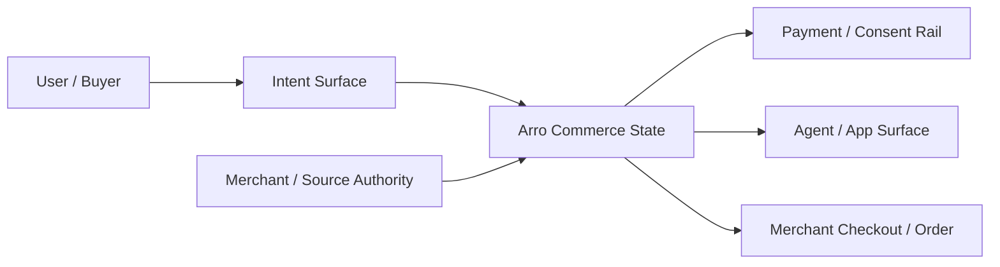
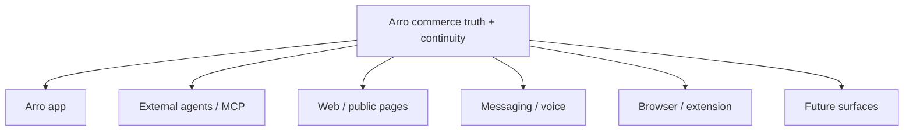

# Arro Product Source of Truth

**Status:** Canonical product intent and capability map
**Audience:** Product, engineering, design, data, agent-integration and operations
**Rule:** This document preserves the product ambition without turning future intent into current runtime claims.

## 1. Product thesis

Arro is an **agentic commerce intelligence, trust, continuity and execution layer**.

It turns shopping intent into source-backed buying state, keeps that state truthful as sources change, and advances the shopper only as far as current merchant capabilities and user authority allow.

```text
natural intent
    ↓
source-backed discovery
    ↓
product evidence + comparison
    ↓
trade-offs / caveats / no-buy signal
    ↓
merchant-authoritative cart or checkout
    ↓
user or delegated authorization
    ↓
payment capability / merchant continuation
    ↓
merchant Order
    ↓
status / cancellation / recovery continuity
```

The durable product unit is **portable buying state**, not a chat answer, card, search result, connector response or checkout button.

A useful buying state is:

- resumable;
- refreshable;
- source-labeled;
- challengeable;
- clear about uncertainty;
- explicit about what authority exists;
- handoff-ready;
- completion-ready when the merchant and user allow it;
- recoverable after retries, crashes or unknown outcomes.

Arro's priority product surface is the first-party Expo shopper. HTTP and MCP are
interoperability surfaces for integrations and agents, not the UI the shopper is
forced to use. The product is **shopper-first and multi-surface**, and every
surface consumes the same commerce truth instead of inventing its own source,
ranking, checkout, or payment semantics.

## 2. Category boundary

Arro sits between five systems:



Arro owns:

- source-aware normalization;
- evidence and freshness state;
- comparison and decision support;
- trust signals and no-buy behavior;
- capability negotiation;
- action policy and allowed next actions;
- purchase continuity and idempotency;
- payment-route orchestration without credential custody;
- merchant Order continuity and recovery;
- cross-surface commerce state.

Arro does **not** become:

- the Merchant of Record;
- the seller of the product;
- a card vault or general wallet;
- a payment processor/acquirer;
- a generic marketplace with paid placement;
- a crawler for unsupported merchants;
- a universal checkout that fabricates merchant authority;
- a generic browser automation layer;
- a generic assistant that happens to call shopping APIs.

## 3. User value pillars

Every important capability should materially advance at least one of these values.

| Pillar           | Meaning in Arro                                                                                      |
| ---------------- | ---------------------------------------------------------------------------------------------------- |
| **Confidence**   | Show where facts came from, how fresh they are, and what is uncertain.                               |
| **Savings**      | Compare real options and total trade-offs without letting commissions determine ranking.             |
| **Continuity**   | Keep buying state alive across agents, sessions, merchant handoffs and retries.                      |
| **Authority**    | Make it explicit who can read, prepare, change, pay, confirm or cancel.                              |
| **Convenience**  | Reduce repeated search, comparison and checkout work without hiding meaningful decisions.            |
| **Independence** | Let the shopper change surfaces or merchants without losing Arro-owned decision context.             |
| **Protection**   | Treat warnings, blockers and “do not buy” as successful product outcomes when evidence demands them. |

## 4. Non-negotiable product principles

### 4.1 Merchant and source authority survive normalization

A normalized Arro product is not a new source of truth. Merchant/source identity, source class, freshness, caveats and capability state remain attached to the normalized result.

A host model may summarize Arro output, but it does not gain permission to rewrite:

- price;
- availability;
- seller identity;
- product attributes;
- fulfillment terms;
- checkout totals;
- payment status;
- Order state.

#### Canonical product identity is different from a merchant offer

Comparison only works if Arro preserves both layers:

```text
canonical source product
  ├─ merchant offer A
  ├─ merchant offer B
  └─ merchant offer C
```

When a source such as Shopify Global Catalog has already clustered offers under one authoritative product identity, Arro keeps that `productId` and preserves each seller-bearing offer/variant. It must not collapse the cluster to the first seller.

Conversely, Arro must **not** fuzzy-merge unrelated products from different sources merely because title, brand or image look similar. Until cross-source identity has authoritative identifiers and conflict rules, source product identity remains the safe grouping boundary.

### 4.2 “No buy” is a valid success state

Arro should not optimize only for conversion. A high-quality result can be:

- the product does not satisfy a hard requirement;
- evidence is too weak;
- the source is stale;
- the seller or offer cannot be verified;
- a cheaper option is materially worse for the user’s stated requirement;
- the safest next action is to wait, compare or buy nothing.

No-buy warnings are part of the canonical agent trust-signal contract today.

### 4.3 Commercial isolation

Money flowing to Arro must not silently become ranking authority.

The following must not change product truth, rank, warnings or checkout totals:

- affiliate economics;
- commissions;
- merchant margin;
- sponsored relationships;
- service-payment receipts;
- host monetization;
- distribution agreements.

Commercial attribution can be recorded and reported separately. It cannot be a hidden input to the shopping answer.

### 4.4 Familiar commerce semantics, novel trust machinery

Shoppers should understand ordinary concepts:

- search;
- compare;
- inspect;
- save/continue;
- choose variant;
- review purchase;
- pay;
- confirm;
- cancel;
- track.

They should not need to learn Arro’s internal policy objects or protocol vocabulary. Structured trust machinery exists to make familiar commerce actions safer.

### 4.5 Smallest truthful state

Every shopper-facing output should answer, as compactly as possible:

1. What did Arro check?
2. What does the source currently say?
3. What is uncertain or important?
4. What is blocked?
5. What can happen next?

### 4.6 Actions come from canonical state

Buttons, agent suggestions and automated next steps must come from current `allowedNextActions`, purchase state, protocol state or equivalent canonical authority—not from UI guesswork.

### 4.7 Multi-business shopping is planning plus per-business execution

Arro may compare or plan across merchants. It must not pretend unrelated merchants share one authoritative cart or checkout.

```text
cross-merchant discovery / comparison
            ↓
      shopping plan
       ↙         ↘
merchant A       merchant B
checkout A       checkout B
order A          order B
```

## 5. Experience grammar

The durable experience grammar is:

> **Natural intent in → structured commerce state out → policy-gated action next → continuity after.**

This works for:

- first-party web/mobile;
- ChatGPT-like or Claude-like agent hosts;
- Hermes and generic MCP clients;
- direct HTTP integrations;
- future browser, messaging, voice, wearable or spatial surfaces.

A new surface is a **client of Arro state**, not a new authority plane.

## 6. Status vocabulary

Documentation uses these labels deliberately.

| Label                   | Meaning                                                                                          |
| ----------------------- | ------------------------------------------------------------------------------------------------ |
| **Implemented**         | Present in current code and covered by tests/verifiers.                                          |
| **Runtime-conditional** | Implemented, but inactive until exact merchant/provider configuration and evidence exist.        |
| **Internal foundation** | Real code/data model exists, but it is not yet a first-class shopper feature or public contract. |
| **Designed extension**  | Product/architecture intent is preserved; implementation is not required for the current launch. |
| **Deferred vision**     | Deliberately later exploration; no current implementation claim.                                 |
| **Rejected / non-goal** | Should not be built as part of Arro’s product model.                                             |

## 7. Current launch capability map

### 7.1 Discovery and product intelligence — Implemented

Current surfaces support:

- source-backed product search;
- product detail;
- comparison;
- source-state inspection;
- product sanity check;
- source labels;
- freshness and caveats;
- product images in search without per-card N+1 detail fetching;
- merchant/seller distinction;
- structured filters, sort and buyer context;
- no-buy warnings and safer-next-action states through agent contracts.

The first-party app currently exposes Discover, Category, Results, Detail, Cart,
Saved, Compare, Checkout, and Account. Checkout uses the same compact purchase
runtime as the API and agent surfaces, while adding deterministic shopper review,
buyer details, fulfillment/address/pickup selection, policies, native payment,
recovery, and receipt presentation. Merchant-hosted continuation is a negotiated
fallback, not the first-party default.

### 7.2 Purchase continuity — Implemented

Canonical agent tools include:

```text
prepare_purchase
update_purchase
prepare_payment        (gated)
provide_payment        (gated)
confirm_purchase       (gated)
get_purchase
cancel_purchase        (limited)
```

The compact purchase lane owns merchant resolution, checkout state, allowed next actions, payment/action state and merchant Order continuity.

### 7.3 Merchant-hosted checkout — Implemented fallback

Merchant-hosted continuation is the broad fallback when Arro cannot or should not directly complete the checkout.

This is not a failure mode. It preserves merchant authority while keeping Arro’s state continuity around the handoff.

### 7.4 Direct payment/authorization routes — Runtime-conditional

Current code contains concrete or bounded routes for:

- Android native Google Pay;
- Processor Tokenizer;
- Arro-hosted Google Pay Web fallback;
- trusted-host payment capabilities;
- AP2 when negotiated;
- Embedded Checkout when runtime/host delegation is enabled;
- exact x402/MPP portable-protocol contracts where a merchant advertises the matching contract.

Each direct route remains narrower than “payments supported.” It is merchant-, handler-, environment-, authority- and evidence-specific.

See [PROTOCOLS.md](PROTOCOLS.md).

### 7.5 Agent interoperability — Implemented

Current canonical MCP tools:

- `agent_diagnostics`;
- `search_products`;
- `get_product_detail`;
- `compare_products`;
- `get_source_state`;
- `sanity_check_product`;
- `prepare_purchase`;
- `update_purchase`;
- `prepare_payment`;
- `provide_payment`;
- `confirm_purchase`;
- `get_purchase`;
- `cancel_purchase`.

The machine-readable capability manifest also requires shopper-visible trust signals such as source labels, freshness, caveats, no-buy warnings, commercial disclosures, authority limits, allowed next actions, confirmation and purchase state.

### 7.6 Data rights and retention — Implemented

The runtime exposes scoped access/export/correction/delete operations for current purchase/order/payment-result/data-rights state. Retention cleanup covers audit records, expired typed-memory proposals, and completed/canceled UCP purchase sessions. Source-governance transitions are retained as durable authority history rather than pretending to have a deletion window.

The original pre-migration `decision_receipts` and `checkout_attempts` transaction tables no longer exist in the authoritative purchase runtime; documentation and future product work must not silently resurrect them as checkout prerequisites.

## 8. Buying state, memory and DecisionReceipt lineage

The original design used `IntentRecord` and `DecisionReceipt` as names for portable decision state. The **product intent remains valuable**; the old runtime authority model does not.

### Current factual state

- Shared contracts still contain DecisionReceipt lineage and `intentRecordId` references.
- Typed `commerce_memory_*` contracts, migrations and services exist.
- Migration `037_runtime_purchase_protocol_cleanup.sql` drops the old `decision_receipts` and `checkout_attempts` tables.
- Current UCP purchase completion does **not** require a DecisionReceipt.
- Current purchase authority comes from scoped purchase/checkout/payment/confirmation/mandate/merchant-Order state.

### Product interpretation

Future user-visible decision history may use a refreshed “receipt”, “decision”, “saved comparison” or “shopping state” concept, but it must be:

- advisory/continuity state;
- source-labeled;
- refreshable;
- correctable/deletable;
- independent of commercial influence;
- never a substitute for current merchant checkout truth;
- never a mandatory proprietary gate in front of standard UCP checkout.

### Commerce memory — Internal foundation

The current typed commerce-memory subsystem supports:

- typed proposals;
- policy reviews;
- committed records;
- staleness marks;
- refresh lineage;
- migration imports;
- explicit authorization and provenance rules;
- retention classes;
- rejection of raw unstructured/payment/commercial-influence fields.

This is an important substrate for future portable shopping continuity, but it should not be marketed as a finished saved-workspace product until a real surface exposes it coherently.

## 9. Source liquidity and intent liquidity

Two separate kinds of coverage matter.

### Source liquidity

Can Arro actually get current, permitted, source-authoritative commerce data/action capability?

Evidence includes:

- live merchant endpoints/connectors;
- UCP/MCP profile discovery;
- namespace/schema authority;
- current capability intersection;
- source freshness;
- conformance;
- seller identity;
- reliability;
- permitted data use;
- auth/attestation state where required.

A partnership announcement, app-directory listing or badge is **not** source authority by itself.

### Intent liquidity

Can Arro resolve the kinds of shopping requests people actually make?

Examples:

- specific known product;
- broad category;
- constraints (“under $100”, “65W USB-C”, “wide fit”);
- exclusions;
- seller/brand preference;
- compatibility;
- comparison;
- uncertain pasted claim;
- “is this worth buying?”;
- “find something better”.

Source breadth without useful intent coverage is not a good shopping product. Intent coverage without source authority is hallucination risk.

## 10. Feature and capability evolution map

The following capabilities remain part of Arro’s broader product direction. Their status matters.

### 10.1 Saved products, collections and decision workspace — Designed extension

Purpose:

- keep interesting products and comparisons;
- preserve why an item was saved;
- refresh stale facts;
- resume across agent/app surfaces;
- attach user constraints without treating them as merchant facts.

Build this on typed commerce memory and canonical product references, not a disconnected wishlist database.

### 10.2 Price watch and stock watch — Designed extension

A watch should preserve:

- product/variant/source identity;
- user threshold or trigger;
- currency and locale;
- latest authoritative observation;
- observation timestamp;
- source change reason;
- alert decision;
- whether the source is still valid.

A later price-history view should be a source-labelled observation series, not a fabricated MSRP comparison. A consumer-facing price alert is the delivery layer over this watch state; background refresh cadence, deduplication, unsubscribe controls and stale-source handling belong to that later lifecycle.

Alerts must not imply price guarantees. Revalidate before purchase. The launch app intentionally does not show a PriceRunner-like price-history chart or price-alert control until this observation/delivery system exists.

### 10.3 Secondhand, resale and refurbished — Designed extension

This is strategically valuable because “best buying option” is often not a new retail SKU.

Required modeling differences include:

- item condition;
- seller identity/reputation source;
- photos/evidence;
- return/warranty terms;
- shipping/pickup constraints;
- one-off inventory;
- grading uncertainty;
- offer freshness.

Do not flatten used/refurbished offers into new-retail product rows if doing so hides material risk.

### 10.4 Coupons, discounts, loyalty and membership — Designed extension

Use merchant-declared/verified capabilities when available. Never invent coupon eligibility or savings.

Discount, loyalty and membership economics must remain separate from independent ranking.

### 10.5 Order, return, refund and support continuity — Designed extension on top of implemented Order continuity

Current runtime preserves merchant Order state and cancellation where supported. The broader product should expose:

- shipping/delivery changes;
- cancellation capability;
- return/refund state;
- warranty/support handoff;
- dispute or exception context;
- exact responsible party.

Arro coordinates and explains; the merchant/provider remains authoritative for fulfillment/refund outcomes.

### 10.6 Identity linking and merchant account continuity — Designed extension / protocol-dependent

When a merchant negotiates identity linking, Arro can use standard authorization to reduce repeated checkout context and preserve merchant account benefits.

Identity linking must be explicit and revocable. It is not permission to merge unrelated merchant identities into a Arro-owned universal identity graph.

### 10.7 Internationalization and localization — Designed extension, required for expansion

Every market expansion must handle at least:

- locale/language;
- currency minor-unit exponent and formatting;
- country/address format;
- tax/duty/shipping ownership;
- units and sizing;
- payment-handler availability;
- product restrictions;
- merchant disclosures;
- return/support language;
- source-specific market availability.

The frontend already avoids assuming all currencies have two decimal places. Future shared i18n/formatting utilities should be introduced when a second locale/market is real, rather than maintaining an unused abstraction in advance.

### 10.8 Visual search, product scan and outfit identification — Deferred vision

Potential inputs:

- camera/photo;
- screenshot;
- product packaging/barcode;
- garment/object in scene;
- visual similarity query.

The output still must converge into the same source-governed product state. Vision is an **intent/evidence input**, not a substitute for merchant product identity.

### 10.9 Visual preview / try-on-like outputs — Deferred vision

Useful only when clearly separated from source facts. Generated previews are illustrative; they must not be presented as exact fit, material, color or merchant evidence.

### 10.10 Social/collaborative shopping — Deferred vision

Possible primitives:

- share a comparison;
- invite opinions;
- shared constraints;
- gift decision;
- household purchase planning.

Shared collaboration must not silently merge private preferences or payment authority.

### 10.11 AEO/GEO and public product/comparison pages — Deferred vision

Public pages can make Arro’s structured, source-backed comparison state discoverable to search/AI systems, but only when:

- source terms permit publication;
- freshness is explicit;
- merchant identity is preserved;
- generated explanation is distinguishable from source content;
- there is no paid ranking disguise.

### 10.12 Intent-led discovery and product Q&A — Designed extension / partially implemented

Current search/detail/sanity-check already answer structured shopping questions. The broader direction is a conversational commerce layer that can answer questions such as:

- “Will this charger work with my laptop?”
- “What am I giving up if I choose the cheaper one?”
- “Is this seller/offer materially worse?”
- “What changed since I saved this?”
- “Is there a reason not to buy this?”

Answers must be constructed from source-backed facts and explicit inference. A language model can explain evidence; it cannot promote an unsupported statement into merchant fact. Personalization may use explicit user-provided constraints, corrections, accepted/rejected options and typed Arro memory; it must not become hidden behavioral tracking or an unsourced ranking override.

Gift discovery is a typed intent, not a separate ranking loophole. When the user supplies them, preserve fields such as occasion, recipient relationship, budget, deadline/delivery region, taste constraints, avoid-list, personalization needs, returnability and gift-receipt preference. Do not create a hidden recipient profile from inferred behavior or third-party data.

### 10.13 One-prompt purchase preparation — Implemented core, expanding experience

The user should be able to express the purchase outcome naturally, while Arro decomposes only the missing commerce decisions:

```text
“Buy the best 65W USB-C charger under $50”
            ↓
search + compatibility + compare
            ↓
select merchant/product
            ↓
prepare merchant checkout
            ↓
ask only for missing buyer/payment/confirmation authority
```

The current `prepare_purchase` / `update_purchase` / payment / confirm lifecycle is the implementation foundation. The product goal is fewer mechanical prompts, not fewer meaningful user decisions.

### 10.14 Guest/session continuity and account migration — Designed extension

First-party and agent surfaces should support low-friction anonymous/session use where practical, then allow explicit migration of selected state into a durable account later.

Rules:

- anonymous state has bounded retention;
- migration is explicit, not automatic identity merging;
- source/product references are refreshed during/after migration;
- payment credentials are never migrated as generic memory;
- disconnecting one host does not destroy Arro-owned account state.

### 10.15 Owned Arro commerce AI / ecommerce super-app — Strategic direction

“Super-app for ecommerce” means one continuity layer across many commerce jobs, not a monolith that owns every underlying system.



All surfaces share source authority, policy, buying state and merchant execution boundaries.

## 11. Discovery strategy

Arro should combine breadth with authority.

Current important source families include:

- Shopify Global Catalog MCP for broad cross-merchant discovery;
- Shopify Storefront Catalog MCP for single-merchant discovery;
- merchant UCP REST/MCP sources;
- carefully configured legacy merchant APIs where the source contract is explicit.

Shopify’s current Global and Storefront Catalog MCP surfaces implement UCP Catalog semantics. Global Catalog is valuable for breadth, but Shopify also marks some enriched fields as inferred; Arro must keep inferred discovery signals distinct from merchant-authored source facts.

A discovery source does not automatically grant:

- cart authority;
- checkout authority;
- payment authority;
- fulfillment authority;
- identity authority.

Those are negotiated separately.

## 12. Commercial model and attribution doctrine

Arro may eventually earn money through merchant attribution, affiliate/partner economics, paid API/service access or other transparent commerce infrastructure models. The invariant is **separation of economics from decision truth**.

Commercial records can answer:

- which source/merchant received a qualified handoff;
- whether an attributed conversion occurred;
- what contract/commission applies;
- what service cost Arro incurred;
- what settlement/reporting state exists.

They must not be hidden inputs to:

- organic product ranking;
- product Q&A;
- source freshness/trust;
- no-buy warnings;
- checkout totals;
- authority decisions.

If Arro ever renders a paid placement, it must be explicit advertising/promotional inventory, visually and computationally separate from independent results.

## 13. Ranking and recommendation doctrine

Ranking should be explainable by shopper intent and source evidence.

Candidate inputs may include:

- hard requirement satisfaction;
- semantic/text relevance;
- price/value constraints;
- availability;
- source freshness;
- seller/offer quality evidence;
- compatibility;
- explicit user preference;
- uncertainty/risk penalties.

Candidate inputs must **not** include hidden commercial payout.

If Arro later supports promoted placements from a source ecosystem, they must remain visibly promotional and separate from independent ranking rather than silently entering the organic score.

## 14. Action and autonomy doctrine

Autonomy is a spectrum, not a boolean.

```text
read / compare
    ↓
prepare purchase
    ↓
update buyer/fulfillment state
    ↓
prepare exact payment action
    ↓
obtain user or delegated authorization
    ↓
provide one-time credential
    ↓
confirm exact checkout
    ↓
merchant Order
```

Autonomous purchasing is acceptable only when current code can bind:

- user/delegated mandate;
- merchant;
- checkout revision;
- amount/currency;
- allowed handler;
- expiry;
- replay identity;
- final merchant Order.

“User usually buys this” is never standing payment authority.

## 15. Product metrics that matter

Do not optimize only for click-through or completed checkout.

Useful metrics include:

- source-backed search success;
- strong-result rate;
- no-buy/safer-alternative usefulness;
- product-detail freshness;
- comparison completion;
- purchase preparation success;
- merchant continuation success;
- direct completion success for eligible routes;
- unknown-outcome recovery success;
- duplicate-completion prevention;
- Order reconciliation success;
- time to first useful agent call;
- time from intent to authoritative next action;
- support incidents per completed Order;
- user return to saved/continued buying state when that surface exists.

## 16. Explicit non-goals

Do not turn Arro into:

- a scraping platform for unsupported sites;
- a paid-ranking marketplace;
- an ad feed;
- a merchant-of-record layer;
- a payment credential store;
- a general-purpose crypto/wallet stack;
- a generic browser agent;
- a generic workflow builder;
- a universal identity provider;
- a model-training sink for private shopping activity;
- a source of invented tax/shipping/refund promises;
- a “global” claim disconnected from actual source/payment/merchant coverage.

## 17. Expansion rule

A future feature enters the production product only when it can answer four questions:

1. **Authority:** Who is allowed to state or perform this?
2. **Truth:** What system is authoritative for the result?
3. **Continuity:** How does Arro preserve/reconcile the state?
4. **User value:** Which confidence/savings/continuity/authority/convenience/independence/protection outcome improves?

If those answers are weak, the feature is not ready no matter how fashionable it is.
