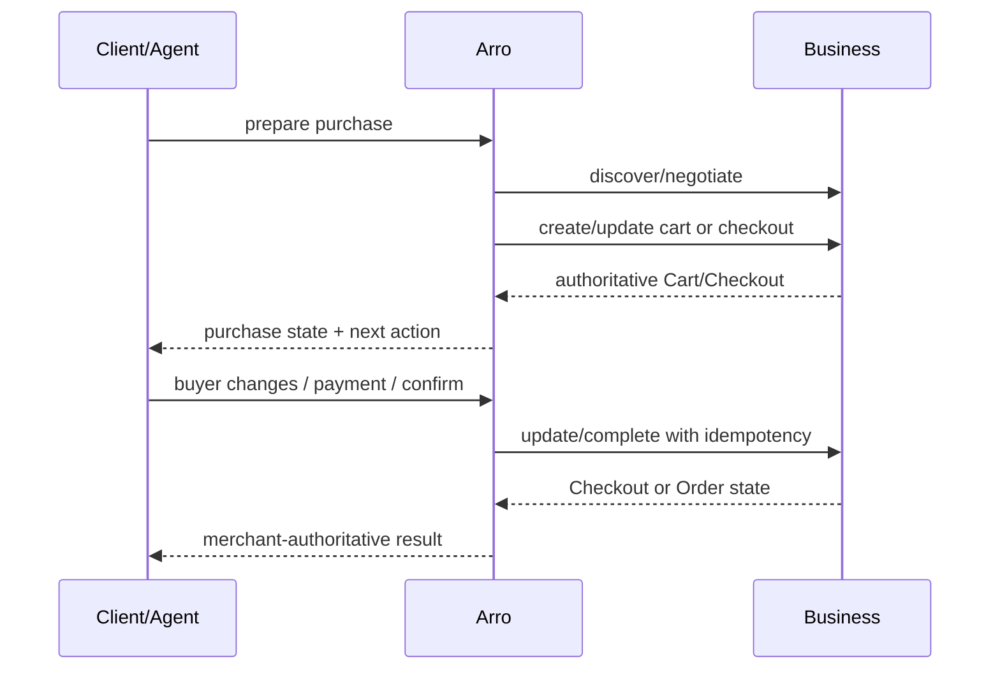

# Arro Protocols, Sources and Payment Interoperability

**Status:** Canonical protocol/interoperability reference
**Runtime baseline:** released UCP core `2026-08-25`; payment handlers keep their own independently negotiated versions
**Rule:** Arro advertises only behavior the running client can execute. Protocol, handler and provider versions are never inferred from one another.


## Conformance findings from live merchants

Arro's UCP schemas were stricter than the specification in four places, and each one blocked every real merchant outright. They are recorded here because the failure mode is always the same shape: a conforming merchant response is rejected by Arro's own validator, and the blocker surfaces as a vague protocol error rather than as the merchant's actual state.

| Arro declared | UCP defines | Effect before the fix |
|---|---|---|
| business service entries without `endpoint` | business REST/MCP entries require a callable `endpoint`; platform entries declare the binding `schema` and do not claim a business server | merchant calls could not resolve a callable business endpoint; adding endpoints to Arro's platform profile would invert the authority relationship |
| capability `requires` as an array of capability names | an object of version constraints, `{ protocol: { min }, capabilities: { name: { min } } }` | merchant profiles carrying version constraints failed validation |
| Cart `status` and `links` required | response status lives in the required `ucp` metadata object; `links` is optional | conforming merchant carts were rejected |
| checkout `payment.instruments` with `minItems: 1` | the list may be empty | a checkout was rejected at exactly the point where it carries the merchant's blocking messages |

Two operational lessons come with them. Merchant storefronts sit behind bot protection that answers an unidentified client with an HTML challenge, so the connector transport must send an honest `User-Agent`; without one, profile discovery returns HTTP 403 and no merchant is reachable at all. And a merchant's `.myshopify.com` handle is not its UCP identity — only the storefront origin serves `/.well-known/ucp`, so checkout must negotiate against the storefront.

When a schema disagrees with a live merchant, check the specification before assuming the merchant is wrong. Arro is the client here.

## 1. Why protocols matter to Arro

Arro should not win by accumulating hundreds of bespoke merchant integrations that each encode commerce differently. The durable architecture is:

```text
business/source declares capability
            ↓
Arro discovers + validates
            ↓
Arro intersects platform/business capability
            ↓
Arro executes only the negotiated operation
            ↓
business response remains authoritative
```

Protocols make merchant capability discoverable; they do not grant authority automatically.

## 2. Normative source hierarchy

When implementation and prose disagree, use this order:

1. exact stable protocol/schema version negotiated for the session;
2. business/platform profiles used by that session;
3. merchant/provider response and signed evidence;
4. current Arro contracts/runtime behavior;
5. Arro documentation;
6. draft protocol documents and roadmap material.

Draft/main UCP documentation can be ahead of a release. Arro implements the exact
schemas and semantics published for `2026-08-25`, not an unversioned `main`
snapshot.

## 3. Current UCP release pin

As verified on 1 September 2026, the official UCP repository lists
`v2026-08-25` as the latest released version.

Arro uses `2026-08-25` for the transaction profile. This is an intentional hard
cut: an older business profile is rejected instead of being merged or silently
upgraded. A profile's `supported_versions` entry points to a complete versioned
profile; negotiation fetches and validates that selected leaf as a whole.

Payment-handler versions remain independent. In particular, the published
Google Pay handler is `com.google.pay` version `2026-01-23`; it is not relabeled
with the UCP core date.

Important `2026-08-25` concepts used by Arro include:

- profiles and dynamic discovery;
- capability intersection;
- Cart;
- Checkout;
- Order;
- identity-linking semantics where negotiated;
- payment-handler declarations;
- REST/MCP/A2A/embedded service bindings as declared;
- idempotency and protocol errors;
- request authentication/signing where the merchant declares and Arro supports it;
- AP2 extension schemas.

Official references:

- <https://github.com/Universal-Commerce-Protocol/ucp/releases>
- <https://ucp.dev/2026-08-25/specification/overview/>
- <https://ucp.dev/2026-08-25/specification/shopping/checkout/rest/>

## 4. Profiles, namespaces and authority

A remote capability/handler schema is not trustworthy merely because a merchant placed a URL in JSON.

Arro validates the authority relationship between:

- namespace;
- specification URL;
- schema URL;
- transport endpoint;
- business origin;
- selected version.

The platform profile advertises only capabilities/handlers Arro can truthfully support in that environment.

Arro's profile is a **platform profile**. Its `dev.ucp.shopping` service entries
declare the REST/MCP client-binding schemas Arro can consume; they do not publish
`endpoint` values, which belong to the merchant/business service Arro calls. The
separate Arro `/v1` descriptor and `/v1/mcp` agent surface are Arro APIs, not raw
merchant UCP Cart/Checkout/Order servers.

Generic UCP store checkers may flag those missing endpoints because they validate
every `/.well-known/ucp` document as a business profile. That warning does not
apply to Arro's platform profile: the UCP `platform_schema` requires the binding
schema, while only the `business_schema` requires REST/MCP/A2A endpoints. Do not
point a canonical `dev.ucp.shopping` declaration at Arro's separate `/v1/mcp`
tool API; doing so would advertise an OpenRPC contract that endpoint does not
implement.

The business response may narrow the active capability set further for a specific operation/session.

### Platform identity and request signing

UCP `2026-08-25` publishes verification keys only in the root `keys` array.
Arro neither emits nor accepts the retired `signing_keys` aliases. Element zero
is the explicitly active signer; prepared or retained verification keys follow
it. Duplicate key IDs and private JWK members fail closed. Production
verification compares the first public key exactly with the configured active
private key's derived public JWK.

The matching private key is loaded from exactly one protected source: inline
deployment-secret JSON in `UCP_PLATFORM_SIGNING_PRIVATE_JWK_JSON`, or the mounted
file named by `UCP_PLATFORM_SIGNING_PRIVATE_JWK_FILE`. Configuring both is an
error. When a negotiated merchant authentication mode requires it, the key signs
the exact outbound bytes with RFC 9421 HTTP Message Signatures and RFC 9530
Content-Digest. `@method`, `@authority`, `@path`, an existing query, `ucp-agent`,
an existing idempotency key, and body digest/content type are bound. HTTP
signatures are an authentication mode, not a universal UCP requirement. Arro's
session/payment HMAC secrets are unrelated and must never be reused.

## 5. Capability intersection

The current rule is simple:

```text
platform supports X
AND business supports X
AND versions/authority are compatible
AND X is relevant to this operation
= X may be active
```

An advertised extension does not become executable if its required parent capability is absent.

Multi-parent extension support follows negotiated parent relevance rather than requiring unrelated parents to be active.

## 6. Transport model

UCP is transport-flexible. Arro can interact with merchant services through the transport actually declared and supported.

### REST — Implemented

Used for merchant shopping operations where the business profile exposes REST.

Checkout REST supports create/get/update/complete/cancel operations. Arro does not interpret an HTTP 2xx alone as proof that payment or Order completion succeeded.

### MCP — Implemented

Used by merchant/catalog integrations and by Arro’s own agent-facing server.

Merchant MCP and Arro’s public MCP are different authority relationships:

- merchant MCP: merchant/source capability;
- Arro MCP: normalized user/agent commerce interface.

Agents do not receive raw merchant connector access through Arro.

### A2A — Protocol-aware, not a required launch surface

UCP defines A2A binding behavior. Arro can preserve it as an interoperability direction without requiring a dedicated A2A runtime for the first production launch.

### Embedded Checkout — Runtime-conditional implementation

Embedded Checkout is a transport/session binding, not proof that every checkout is embeddable.

A merchant must advertise embedded support and the specific checkout must provide the relevant delegate configuration. The client’s “completed” event is never merchant Order truth.

Official reference: <https://ucp.dev/2026-08-25/specification/shopping/checkout/embedded/>

## 7. Catalog and discovery interoperability

Discovery has different truth characteristics from checkout.

### Shopify Global Catalog MCP — Implemented source adapter

Current Shopify documentation describes Global Catalog MCP as a cross-merchant product-discovery interface implementing UCP Catalog semantics.

Current tools include:

- `search_catalog`;
- `lookup_catalog`;
- `get_product`.

Shopify currently clusters search results by Universal Product ID (UPID) and can include offers from multiple merchants in the returned product. Arro therefore requests the offer view, keeps the canonical source `productId`, and expands distinct seller-bearing variants into normalized offer rows instead of selecting the first seller. A single merchant's ordinary color/size option matrix is not exploded merely because several variants exist.

#### Pagination contract

Global Catalog pagination is cursor-based. The connector accepts the source cursor only for the source it belongs to and preserves the returned `pagination.cursor`/`has_next_page` metadata internally. The public Arro API never exposes that raw source cursor: it wraps `{sourceId, sourceCursor}` in a bounded opaque Arro continuation token.

A continuation token is accepted only while that exact source is still eligible under the request policy. Arro currently returns a continuation only when one cursor-capable source was requested and dispatched. For multi-source/federated search, advancing all source cursors after ranking would be lossy because some fetched candidates may have fallen below the global page cut; safe federation needs buffered merge state first.

The current catalog shape also carries structured option values (`id`, `label`, `available`, `exists`), effective product-level `selected` options, selected-option labels, product rating/count and seller/variant-level availability/condition. Arro preserves those fields instead of collapsing them into strings. `get_product` is the product-detail primitive: an exact variant ID fully determines the configuration; otherwise Arro forwards provider-neutral `selected` values and treats the returned `product.selected` as the source's effective selection. A response that relaxes or changes the requested selection remains useful for shopping, but it is not purchase-ready until the shopper resolves the mismatch. `available`/`exists` are load-bearing rather than decorative: an axis whose alternatives are all unsellable carries no shopper decision, so the effective selection settles it.

`preferences` decides what the source gives up when a combination cannot exist, dropping from the end of the order first. Measured against Global Catalog with an impossible Black + 512GB pair: `['Color','Storage']` keeps the colour, `['Storage','Color']` keeps the storage, and sending none at all keeps whichever the source prefers — which was not the axis the shopper had just chosen. Arro therefore names its own choices first and the values it carried forward last, so a default is surrendered before a decision. Selections cross the boundary as the name/label pairs UCP declares; Arro's option ID and its record of which values the shopper actually chose stay on this side of it.

Global Catalog can provide high source liquidity, but some Shopify fields are explicitly marked as **inferred**. Arro should treat those as discovery/merchandising signals, not silently reclassify them as merchant-authored facts.

Reference: <https://shopify.dev/docs/agents/catalog/global-catalog>

### Shopify Storefront Catalog MCP — Implemented source adapter

Storefront Catalog MCP scopes discovery to one merchant and uses UCP-conforming catalog tools on the merchant `/api/ucp/mcp` endpoint. Product detail uses UCP `get_product`, the same provider-neutral detail contract Arro uses for other UCP MCP sources; Shopify-specific source routing does not leak into the public Arro product model.

Reference: <https://shopify.dev/docs/agents/catalog/storefront-catalog>

### Shopify Cart MCP evolution

Shopify has moved Storefront cart semantics toward UCP Cart MCP. Arro should prefer current UCP cart capability paths when a source exposes them instead of retaining deprecated Shopify-specific cart names indefinitely.

Reference: <https://shopify.dev/changelog/storefront-mcp-cart-tools-are-being-deprecated-in-favour-of-ucp-cart-mcp>

### Legacy/other source adapters

A configured REST/GraphQL/source adapter can be valid when:

- the merchant/source is explicit;
- endpoint and auth are configured deliberately;
- returned fields are normalized with provenance;
- safe URL/network rules pass;
- it is not mistaken for checkout authority it does not have.

## 8. Cart and Checkout semantics

Arro’s current transaction path preserves the merchant’s authoritative state.



Important rules:

- Arro does not fabricate cart/checkout totals from search results.
- The app can review merchant-returned buyer fields, every fulfillment method,
  delivery address or pickup destination, fulfillment option/group, messages,
  links, and policies without flattening them into an Arro-only checkout model.
- Review mutations carry the exact `checkoutSnapshotHash` the shopper saw. Arro
  rejects a stale update or confirmation after merchant state changes.
- UCP update payloads preserve full-replacement semantics. Arro projects the
  requested change onto the latest authoritative checkout and sends the complete
  buyer/fulfillment collection, preserving untouched methods, groups,
  destinations, line-item bindings, and stable merchant IDs.
- Every valid merchant update response replaces Arro's checkout snapshot. Local
  estimates or the submitted patch never become the new authority.
- Merchant messages determine the field, fulfillment, disclosure, warning, and
  blocker UI. Policy/link presentation remains attached to the returned checkout.
- Payment acceptance is not completion.
- Timeout after a write creates an **unknown outcome** until Arro retrieves/reconciles merchant state.
- A new completion attempt must not be fired blindly after an unknown outcome.

## 9. Order truth

The merchant Order is the terminal commerce truth Arro cares about.

Current UCP Order semantics model full current state and can carry lifecycle/adjustment information. Arro persists validated merchant Order state and accepts signed full-Order webhooks.

Arro may say:

- Order confirmed;
- Order updated;
- cancellation requested/confirmed where merchant state says so;
- exact blocker/unknown state.

Arro must not infer an Order from:

- payment-sheet closure;
- payment UI success callback;
- action surface `done` event;
- provider session creation;
- redirect completion;
- HTTP success without authoritative checkout/Order state.

## 10. Payment handlers: contract, not brand checkbox

In UCP, a payment handler describes a concrete payment/instrument contract. A merchant declaration is routing input; it is not permission to use arbitrary credentials.

Arro separates:

```text
public handler metadata
        ≠
private provider/tokenizer credentials
        ≠
user authorization
        ≠
merchant Order
```

## 11. Merchant-hosted checkout — Required fallback

Merchant-hosted continuation is the broadest compatibility route when the
first-party app cannot execute the merchant's checkout or the merchant returns
`requires_escalation`. It is not the preferred presentation for a negotiated,
device-ready native handler.

It keeps sensitive merchant/payment work in the merchant’s existing checkout while Arro preserves:

- selected product/purchase identity;
- checkout continuity;
- handoff state;
- subsequent retrieval/reconciliation where supported.

This fallback remains available even as native/direct routes expand.

## 12. Processor Tokenizer — Implemented, activation-specific

Arro supports the UCP Processor Tokenizer boundary and a production-native Stripe specialization of it.

`UCP_PAYMENT_HANDLER_SPECS_JSON` describes non-secret executable handler metadata. `UCP_TOKENIZER_AUTH_JSON` holds private origin/handler-specific credentials.

`POST /tokenize` receives the handler-defined source reference plus the required UCP binding `{ type, id }`. Arro also supplies merchant origin, checkout snapshot hash, and action ID as extension members; a standard tokenizer may ignore members it does not implement, while Arro's Stripe merchant contract verifies them. The tokenizer returns the standard opaque `{ token }` response. Arro vaults that token with consume-once semantics and a TTL no later than the signed action, then passes it only to the bound merchant checkout. Arro does not manufacture a merchant handler declaration from private auth config.

This adapter is also the natural interoperability seam for merchants whose underlying processor is Stripe or another PSP when the merchant exposes the appropriate tokenization contract.

## 13. Google Pay — Implemented runtime, activation-dependent

Arro contains a first-party Android native executor and a separately activated Arro-hosted Web fallback for exact `com.google.pay` merchant handler declarations. The app negotiates a signed action, checks the merchant request against the Android build environment and device readiness, presents Google's native control/sheet, and submits only the opaque result. A native result never requires a browser Origin; a Web result always does. This direct handler is separate from Google Pay presented inside Stripe PaymentSheet.

Production activation requires real Google/merchant configuration and evidence. Google’s UCP program also has its own Google AI-surface integration/approval model; Arro must not conflate “Google Pay credential provider works” with “approved for Google Search/Gemini native checkout.”

The Render Blueprint leaves direct Google Pay disabled and fixes the declared environment to `PRODUCTION`. It publishes no example gateway or TEST handler. Enabling the route requires the exact launch merchant ID, handler ID, gateway, approval reference, and production handler declaration.

Google states that merchants remain Merchant of Record in its UCP merchant model.

References:

- <https://developers.google.com/pay/api/universal-commerce-protocol/google-pay-payment-handler>
- <https://developers.google.com/merchant/ucp/guides>

## 14. Other wallet/provider surfaces — capability watchlist, not launch claims

Apple Pay, PayPal, Klarna, Adyen, Affirm and card-network agent-payment/token products remain relevant payment-handler or managed-channel candidates. Their presence in the broader product strategy is **not** an assertion that Arro can execute them today. Add a runtime only after a selected merchant/provider exposes an exact supported contract, Arro can bind the credential to that merchant/checkout, and production activation has real evidence.

Apple Pay or another platform wallet can fit the same model later: the platform/provider tokenizes the instrument and Arro handles only the resulting scoped credential/reference required by the merchant contract. Raw PAN/CVV or unrestricted wallet credentials do not enter generic Arro memory. Current iOS native checkout is Stripe PaymentSheet card entry, not Apple Pay.

## 15. AP2 — Optional negotiated security extension

AP2 is **not** a universal prerequisite for UCP checkout.

When the AP2 mandate extension is negotiated and active, the checkout becomes cryptographically security-locked: business authorization and user/agent mandates bind the exact terms and completion flow.

Arro therefore treats AP2 as:

- implemented protocol/runtime support;
- optional by negotiation;
- strict once negotiated;
- activation-dependent on trusted issuer/key configuration and real evidence when advertised.

Official reference: <https://ucp.dev/2026-08-25/specification/payment/extensions/ap2-mandates/>

## 16. UCP Actions — Released, typed and intentionally isolated

UCP `2026-08-25` defines Actions as typed, extension-owned outstanding work
returned under an `actions` map. Payment Authentication currently defines
`dev.ucp.common.payment.device_data_collection` and
`dev.ucp.common.payment.three_ds_challenge`.

Arro's contracts preserve typed action state, but the platform does not advertise
the Payment Authentication extension until a client build has a constrained
runner for both action types. A generic browser opener does not qualify.

Rules:

- only known negotiated action types execute;
- extension version must match;
- URL/origin must be authorized by the payment handler, not merely by the merchant page;
- source/window/action ID/version are bound where applicable;
- action completion triggers authoritative checkout refresh;
- an action `done` event is not payment/Order success;
- unknown action types are explicit unsupported blockers, not generic executable content.

Released reference: <https://ucp.dev/2026-08-25/specification/payment/extensions/authentication/>

## 17. x402 and MPP — Experimental exact-contract adapters

Arro contains explicit x402 and MPP portable payment protocol adapters.

They are **not official UCP payment handlers** merely because Arro can bind them into an experimental handler declaration.

They may run only when:

- the selected merchant advertises the exact native/experimental contract;
- protocol version matches;
- challenge/resource is bound to the current checkout;
- amount/currency/merchant are exact;
- caller provides a matching protocol-native one-time result;
- merchant returns authoritative completion/Order state.

These paths do not grant Arro wallet custody or source/ranking authority.

## 18. Stripe — merchant-owned processor path

Arro executes Stripe only when the merchant advertises an exact production Processor Tokenizer handler with `gateway: stripe`, `credential_type: stripe_payment_intent`, an HTTPS `native_session_url`, and `/tokenize`. Production configuration fails closed if Processor Tokenizer is enabled without this live native contract.

The signed action-session endpoint refreshes the merchant checkout, requests an idempotent live manual-capture PaymentIntent, rejects any amount/currency/mode mismatch, and binds the PaymentIntent ID uniquely to one action. iOS and Android present the merchant's PaymentSheet for Visa/Mastercard; eligible Android devices may use Stripe Google Pay. The client returns only the bound PaymentIntent ID. The merchant `/tokenize` endpoint verifies its state and binding and returns the opaque UCP token used for completion.

The merchant owns the Stripe account, publishable/secret keys, session and tokenization endpoints, capture/cancel/refund/webhook behavior, and final Order. Arro stores no Stripe secret key and never receives raw card data.

There is deliberately no generic Stripe switch, reusable Stripe credential, or
private-preview Shared Payment Token branch. Adding a second Stripe protocol is
justified only when Arro has an executable merchant contract that the current
Processor Tokenizer path cannot represent.

## 19. Identity linking

UCP identity linking provides an OAuth-based way for a platform to act with a user’s merchant account authorization where negotiated.

Arro should use identity linking for concrete commerce value such as:

- existing address/account context;
- loyalty/member benefits;
- merchant account order continuity;
- less repeated buyer input.

It must remain scoped and revocable. It does not turn Arro into the merchant identity provider.

## 20. Agent/MCP authority

Arro’s public MCP layer is intentionally higher-level than raw UCP transport.

```text
host intent
   ↓ advisory
Arro MCP tool contract
   ↓ validated
source / UCP / payment adapter
   ↓ authoritative result
Arro purchase + trust state
   ↓ structured
host rendering
```

A host can downscope Arro capabilities. It cannot widen them.

Host-side search, browser research, wallet skills or Shopify skills remain advisory unless the current Arro operation explicitly uses them through a trusted contract.

## 21. Protocol evolution policy

Before upgrading a protocol component:

1. identify the exact released version;
2. diff schemas and operation semantics;
3. update fixtures/contracts/client together;
4. make compatibility an explicit product decision rather than an automatic shim;
5. isolate unsupported or draft features behind explicit runtime boundaries;
6. run protocol + app-level verifiers;
7. update this document with **stable vs draft** status.

Never chase `main` because it looks newer.

## 22. External factual verification references

The protocol/provider statements above were rechecked on **1 September 2026** against primary documentation rather than preserved from the old roadmap by assumption.

| Topic | Primary reference | Fact used by Arro |
|---|---|---|
| UCP released version | <https://github.com/Universal-Commerce-Protocol/ucp/releases/tag/v2026-08-25> | `v2026-08-25` is the current released core used by Arro. |
| UCP negotiation/checkout | <https://ucp.dev/2026-08-25/specification/overview/> | capability intersection is negotiated; a selected older-version URI is a complete leaf profile, not a merge overlay. |
| Checkout REST | <https://ucp.dev/2026-08-25/specification/shopping/checkout/rest/> | create/get/update/complete/cancel lifecycle and transport semantics. |
| AP2 | <https://ucp.dev/2026-08-25/specification/payment/extensions/ap2-mandates/> | optional negotiated mandate extension; strict once active. |
| Embedded Checkout | <https://ucp.dev/2026-08-25/specification/shopping/checkout/embedded/> | service support does not imply every checkout supports embedding; per-checkout delegation applies. |
| Payment Authentication Actions | <https://ucp.dev/2026-08-25/specification/payment/extensions/authentication/> | released typed DDC and 3DS work; action completion still requires authoritative checkout reconciliation. |
| Shopify Global Catalog | <https://shopify.dev/docs/agents/catalog/global-catalog> | cross-merchant UCP Catalog MCP; inferred fields are not equivalent to merchant-authored facts. |
| Shopify Storefront Catalog | <https://shopify.dev/docs/agents/catalog/storefront-catalog> | single-merchant UCP Catalog MCP with current catalog tool names. |
| Shopify Cart MCP | <https://shopify.dev/changelog/storefront-mcp-cart-tools-are-being-deprecated-in-favour-of-ucp-cart-mcp> | current Storefront cart direction is UCP Cart MCP. |
| Google merchant UCP | <https://developers.google.com/merchant/ucp/guides> | Google surface go-live is approval-gated; UCP profile/payment/order integration remains merchant-controlled. |
| Google Pay UCP handler | <https://developers.google.com/pay/api/universal-commerce-protocol/google-pay-payment-handler> | Google Pay acts as a credential-provider/payment-handler path rather than making Arro the processor. |
| Stripe agentic commerce | <https://docs.stripe.com/agentic-commerce> | agentic commerce remains private preview; Shared Payment Tokens hide underlying credentials. |
| Stripe SPT | <https://docs.stripe.com/agentic-commerce/concepts/shared-payment-tokens> | SPTs are seller-scoped, usage/expiry limited credentials; not a generic reusable wallet token. |

Recheck these sources when upgrading protocol/provider behavior. Provider/private-preview status is time-sensitive.
