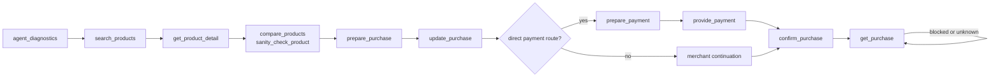

# Arro Agent Distribution Kit

Arro exposes one canonical MCP server and the same commerce lifecycle over HTTP.

## Endpoint

```text
POST {PUBLIC_BASE_URL}/v1/mcp
```

`PUBLIC_BASE_URL` is the deployment's public HTTPS origin, and the same origin serves `/.well-known/ucp`. UCP requires HTTPS, so a local runtime must be exposed through a public HTTPS origin (a named tunnel is enough) before an external agent can negotiate with it.

## First-success flow

`cancel_purchase` is available where the merchant/runtime supports cancellation. `get_source_state` reports which sources are currently usable and why, and is the right first call when results look thin.



## Authority model

The agent is **not source authority** for product facts, checkout totals or Orders.

Arro must **not become source authority** merely because it normalizes or remembers a merchant response.

Merchant/source identity and freshness remain visible through product results and diagnostics. Merchant Order state remains completion truth.

## Tool naming

The canonical tool set is returned by MCP `tools/list`. Do not build integrations against retired aliases.

`confirm_purchase` is intentionally a gated write operation: it must use the exact prepared purchase/payment state and required user/AP2 authority.

## Agent session IDs

Agent session identifiers use the `mcp_arro_` lifecycle where applicable. Keep them opaque.

## Rendering

Hosts should render trust/state data from structured tool output rather than scraping prose.

The diagnostics examples include `renderedTrustSignals`; hosts should surface the fields that materially help a shopper understand:
- source/merchant;
- freshness;
- price/availability;
- required buyer action;
- checkout/payment state;
- final merchant Order.

## Hermes

Recommended skill:

```text
agent-skills/arro-commerce-preflight/SKILL.md
```

Example config:

```text
agent-skills/arro-commerce-preflight/examples/hermes-mcp-config.yaml
```

Hermes is a host surface, not a privileged source. The same Arro scope and commerce invariants apply.

## Generic MCP

Initialize the MCP session, list tools, then call the same canonical tools. Examples live under:

```text
agent-skills/arro-commerce-preflight/examples/
```

The examples cover:
- generic search;
- complete purchase lifecycle;
- x402/MPP portable payment negotiation;
- merchant-declared portable handlers;
- proprietary adapter boundaries.

## Direct HTTP

Agents that do not need MCP may call the public HTTP API. Search begins at:

```text
POST /v1/catalog/search
```

Use HTTP request IDs/idempotency keys on state-changing commerce operations.

## Payment

Do not send raw reusable payment credentials through prompts.

The agent should follow the route returned by Arro:
- merchant-hosted continuation;
- supported signed payment action;
- host-native authorized route;
- portable protocol proof;
- AP2 when actually negotiated.

A payment UI event is not an Order. Continue until `get_purchase`/merchant state proves completion or reports the exact blocker.

## Debugging

Start with `agent_diagnostics`. Then inspect:
1. source availability;
2. host rendering support;
3. payment capability intersection;
4. purchase state;
5. merchant continuation;
6. request IDs.

Do not retry completion blindly after a timeout. Retrieve/reconcile first.
